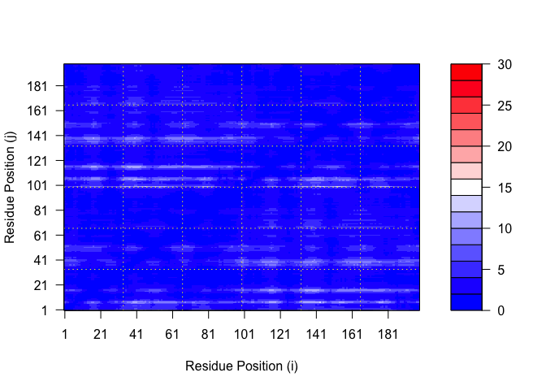

# Class11: AlphaFold
Gabriella Tanoto (A18024184)

- [Background – Before AlphaFold: Structural
  prediction](#background--before-alphafold-structural-prediction)
- [AlphaFold2](#alphafold2)
  - [predicting Alignment Error
    Domains](#predicting-alignment-error-domains)
  - [Residue conservation from alignment
    file](#residue-conservation-from-alignment-file)
  - [HOMEWORKKK](#homeworkkk)

# Background – Before AlphaFold: Structural prediction

People have been using physics-based and knowledge-based approach. In
the physics-based approach, they use the **potential energy** terms that
is from the Physical Theories; from bond stretches, angle, and
rotations, and then take into account both *bonded* and *non-bonded*
interactions.

- *Physics-Based:*

There is many strengths: interpretable, broadly applicable, and cleae
pathways to improve accuracy. Problems: have to be approximate (we don’t
have big enough sources).

- *Knowledge-Based:*

We can use previous knowledge of protein structures, how it usually
forms. Strength: It’s easier than the physics-based predictions, and
computationally fast. Problems: it’s limited by the availability of data
(if it’s a new protein that hasn’t been much studied, it’s not good
enough to make good predictions).

CASP is used to check how good people’s results are to get better
prediction of protein folding.

# AlphaFold2

Multiple sequence alignment is actually the key to the winning method.
The MSA detects Co-Evolutions, which indicates that the amino acid
probably contacts each other!! \<\< KEY

> Contacts in proteins are evolutionarily conserved, encoded in an MSA
> as coevolution.

AlphaFold takes the predicted contact maps, where spots that are outside
of the diagonal is contact points. Then, once they have the bigger
picture of prediction, they used the Physics to refine it.

> MSA –\> contact points –\> Knowledge & Physics based refining.

We can use the website
[AlphaFold2.ipynb](https://colab.research.google.com/github/sokrypton/ColabFold/blob/main/AlphaFold2.ipynb)

Here, we read the results from AlphaFold and try to interpret all the
models and quality score metrics.

``` r
library(bio3d)

pth <-  "HIV_dimer_23119/"
pdb.files <- list.files(path=pth, full.names = TRUE, pattern = ".pdb")
```

Align and superpose all the models

``` r
file.exists(pdb.files)
```

    [1] TRUE TRUE TRUE TRUE TRUE

``` r
pdbs <- pdbaln(pdb.files, fit = TRUE, exefile="msa")
```

    Reading PDB files:
    HIV_dimer_23119//HIV_dimer_23119_unrelaxed_rank_001_alphafold2_multimer_v3_model_2_seed_000.pdb
    HIV_dimer_23119//HIV_dimer_23119_unrelaxed_rank_002_alphafold2_multimer_v3_model_5_seed_000.pdb
    HIV_dimer_23119//HIV_dimer_23119_unrelaxed_rank_003_alphafold2_multimer_v3_model_4_seed_000.pdb
    HIV_dimer_23119//HIV_dimer_23119_unrelaxed_rank_004_alphafold2_multimer_v3_model_1_seed_000.pdb
    HIV_dimer_23119//HIV_dimer_23119_unrelaxed_rank_005_alphafold2_multimer_v3_model_3_seed_000.pdb
    .....

    Extracting sequences

    pdb/seq: 1   name: HIV_dimer_23119//HIV_dimer_23119_unrelaxed_rank_001_alphafold2_multimer_v3_model_2_seed_000.pdb 
    pdb/seq: 2   name: HIV_dimer_23119//HIV_dimer_23119_unrelaxed_rank_002_alphafold2_multimer_v3_model_5_seed_000.pdb 
    pdb/seq: 3   name: HIV_dimer_23119//HIV_dimer_23119_unrelaxed_rank_003_alphafold2_multimer_v3_model_4_seed_000.pdb 
    pdb/seq: 4   name: HIV_dimer_23119//HIV_dimer_23119_unrelaxed_rank_004_alphafold2_multimer_v3_model_1_seed_000.pdb 
    pdb/seq: 5   name: HIV_dimer_23119//HIV_dimer_23119_unrelaxed_rank_005_alphafold2_multimer_v3_model_3_seed_000.pdb 

Insert a reference PDB file for 1AKE:

``` r
pdb <- read.pdb("1ake")
```

      Note: Accessing on-line PDB file
       PDB has ALT records, taking A only, rm.alt=TRUE

We can use baseR `plot()` function:

``` r
plot(pdbs$b[1,], typ="l", ylim=c(0,100), ylab="PLDDT Score")
lines(pdbs$b[2,], typ="l", col="green")
lines(pdbs$b[3,], typ="l", col="blue")
lines(pdbs$b[4,], typ="l", col="purple")
lines(pdbs$b[5,], typ="l", col="red")
abline(v=100, col="gray")
```


We can also use bio3D’s `plotb3()` function:

``` r
plotb3(pdbs$b[1,], typ="l", lwd=2, sse=pdb)
```

    Warning in plotb3(pdbs$b[1, ], typ = "l", lwd = 2, sse = pdb): Length of input
    'sse' does not equal the length of input 'x'; Ignoring 'sse'

``` r
points(pdbs$b[2,], typ="l", col="green")
points(pdbs$b[3,], typ="l", col="blue")
points(pdbs$b[4,], typ="l", col="purple")
points(pdbs$b[5,], typ="l", col="red")
abline(v=100, col="gray")
```


Clustering of our models:

``` r
rd <- rmsd(pdbs, fit=T)
```

    Warning in rmsd(pdbs, fit = T): No indices provided, using the 198 non NA positions

``` r
range(rd)
```

    [1]  0.000 13.406

Heatmap

``` r
library(pheatmap)

colnames(rd) <- paste0("Model",1:5)
rownames(rd) <- paste0("Model",1:5)
pheatmap(rd)
```


## predicting Alignment Error Domains

Predicted Aligned Error (PAE) is more shown in the JSON files.

``` r
library(jsonlite)

pae_files <- list.files(path="HIV_dimer_23119/",
                        pattern=".*model.*\\.json",
                        full.names = TRUE)

pae1 <- read_json(pae_files[1],simplifyVector = TRUE)
pae2 <- read_json(pae_files[2],simplifyVector = TRUE)
pae3 <- read_json(pae_files[3],simplifyVector = TRUE)
pae4 <- read_json(pae_files[4],simplifyVector = TRUE)
pae5 <- read_json(pae_files[5],simplifyVector = TRUE)

attributes(pae1)
```

    $names
    [1] "plddt"   "max_pae" "pae"     "ptm"     "iptm"   

Now we can look at each residue’s scores, and determine what’s their
highest (worst) PAE.

``` r
head(pae1$plddt) #the score for PAE
```

    [1] 91.44 96.06 97.38 97.38 98.19 96.94

``` r
pae1$max_pae #13.58
```

    [1] 13.57812

``` r
pae2$max_pae #15.71
```

    [1] 15.71094

``` r
pae3$max_pae #12.41 This is the best one for mine!
```

    [1] 12.41406

``` r
pae4$max_pae #19.95
```

    [1] 19.95312

``` r
pae5$max_pae #29.86
```

    [1] 29.85938

\*\* This is an important step, if not, we’d not know which one is the
best Model for our Gene sequence. It’s not always the 1st that’s the
best.

Plotting the umber of residue of the PAE, using the same Z-range.

``` r
#Plot PAE1
plot.dmat(pae1$pae, 
          xlab="Residue Position (i)",
          ylab="Residue Position (j)",
          zlim=c(0,30))
```


``` r
#plot PAE5
plot.dmat(pae5$pae, 
          xlab="Residue Position (i)",
          ylab="Residue Position (j)",
          zlim=c(0,30))
```


``` r
#plot PAE3
plot.dmat(pae3$pae, 
          xlab="Residue Position (i)",
          ylab="Residue Position (j)",
          zlim=c(0,30))
```



## Residue conservation from alignment file

First, we open the alignment file.

``` r
aln_file <- list.files(path="HIV_dimer_23119/",
                       pattern=".a3m$",
                        full.names = TRUE)
aln_file
```

    [1] "HIV_dimer_23119//HIV_dimer_23119.a3m"

``` r
aln <- read.fasta(aln_file[1], to.upper = TRUE)
```

    [1] " ** Duplicated sequence id's: 101 **"
    [2] " ** Duplicated sequence id's: 101 **"

> How many sequences are aligned in this file?

``` r
dim(aln$ali)
```

    [1] 5378  132

Next, we score the conserved residues in our alignment using the
`conserv()`:

``` r
cnsv <- conserv(aln)
plotb3(cnsv[1:99], sse=trim.pdb(pdb, chain="A"),
       ylab="Conservation Score")
```

Some regions are more conserved than others, indicating their importance
in the protein structure. These really conserved positions will stand
out if we enerate consensus sequence with a **high** cut-off value.

``` r
con <- consensus(aln, cutoff = 0.9)
con$seq
```

      [1] "-" "-" "-" "-" "-" "-" "-" "-" "-" "-" "-" "-" "-" "-" "-" "-" "-" "-"
     [19] "-" "-" "-" "-" "-" "-" "D" "T" "G" "A" "-" "-" "-" "-" "-" "-" "-" "-"
     [37] "-" "-" "-" "-" "-" "-" "-" "-" "-" "-" "-" "-" "-" "-" "-" "-" "-" "-"
     [55] "-" "-" "-" "-" "-" "-" "-" "-" "-" "-" "-" "-" "-" "-" "-" "-" "-" "-"
     [73] "-" "-" "-" "-" "-" "-" "-" "-" "-" "-" "-" "-" "-" "-" "-" "-" "-" "-"
     [91] "-" "-" "-" "-" "-" "-" "-" "-" "-" "-" "-" "-" "-" "-" "-" "-" "-" "-"
    [109] "-" "-" "-" "-" "-" "-" "-" "-" "-" "-" "-" "-" "-" "-" "-" "-" "-" "-"
    [127] "-" "-" "-" "-" "-" "-"

Now, we can look at these conserved atoms in Mol\* by making a file that
maps the conservation score to the Occupancy column of the PDB file.
This file can then be viewed in Mol\* and other platforms.

``` r
m1.pdb <- read.pdb(pdb.files[1])
occ <- vec2resno(c(cnsv[1:99], cnsv[1:99]), m1.pdb$atom$resno)
write.pdb(m1.pdb, o=occ, file="m1_conserv.pdb")
```

Result from Mol\*:


## HOMEWORKKK

Do this whole pipeline for our gene (from the Find A Gene project!).
Plug in the ColabFold.
