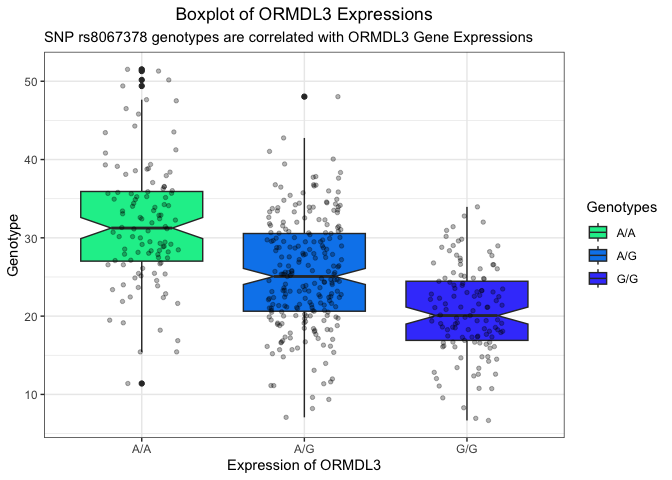

# Class12
Gabriella Tanoto (A18024184)

- [Section 1 - Proportion of G/G in
  Population](#section-1---proportion-of-gg-in-population)
- [HOMEWORK CLASS 12](#homework-class-12)
  - [Section 4: Population Scale
    Analysis](#section-4-population-scale-analysis)

# Section 1 - Proportion of G/G in Population

``` r
MXL <- read.csv("373531-SampleGenotypes-Homo_sapiens_Variation_Sample_rs8067378.csv")
```

> Q5. What proportion of the Mexican Ancestry in Los Angeles sample
> population (MXL) are homozygous for the asthma associated SNP (G\|G)?

``` r
table(MXL$Genotype..forward.strand.) / nrow(MXL)*100
```


        A|A     A|G     G|A     G|G 
    34.3750 32.8125 18.7500 14.0625 

9 out of 64 (14.01%) of the samples of Mexican ancestry individuals are
homozygous G/G

Let’s now compare it with the GBR population

``` r
GBR <- read.csv("373522-SampleGenotypes-Homo_sapiens_Variation_Sample_rs8067378.csv")
```

Proportion of G\|G in this GBR population is:

``` r
round(table(GBR$Genotype..forward.strand.)/nrow(GBR)*100, 2)
```


      A|A   A|G   G|A   G|G 
    25.27 18.68 26.37 29.67 

Here, the proportion of homozygous G in the population is: 29.67%. It is
a higher proportion — almost twice more homozygous GG than the MExican
nacestry in LA.

# HOMEWORK CLASS 12

## Section 4: Population Scale Analysis

The following file will be used to determine if the SNP rs8067378 has
any effect on the expression of ORMDL3 gene. It shows the genotype of
the SNP and the expression level of ORMDL3.

> Q13: Read this file into R and determine the sample size for each
> genotype and their corresponding median expression levels for each of
> these genotypes.

Opening the file:

``` r
snpfile <- read.table("rs8067378_ENSG00000172057.6.txt")
```

Genotypes sample size:

``` r
table(snpfile$geno)
```


    A/A A/G G/G 
    108 233 121 

Median expression levels for each of the genotypes:

``` r
#for Genotype A/A, the median expression level of ORMDL3 is 31.25
summary(snpfile[snpfile$geno=="A/A", ])
```

        sample              geno                exp       
     Length:108         Length:108         Min.   :11.40  
     Class :character   Class :character   1st Qu.:27.02  
     Mode  :character   Mode  :character   Median :31.25  
                                           Mean   :31.82  
                                           3rd Qu.:35.92  
                                           Max.   :51.52  

``` r
#for Genotype A/G, the median expression level of ORMDL3 is 25.07
summary(snpfile[snpfile$geno=="A/G", ])
```

        sample              geno                exp        
     Length:233         Length:233         Min.   : 7.075  
     Class :character   Class :character   1st Qu.:20.626  
     Mode  :character   Mode  :character   Median :25.065  
                                           Mean   :25.397  
                                           3rd Qu.:30.552  
                                           Max.   :48.034  

``` r
#for Genotype G/G, the median expression level of ORMDL3 is 20.07
summary(snpfile[snpfile$geno=="G/G", ])
```

        sample              geno                exp        
     Length:121         Length:121         Min.   : 6.675  
     Class :character   Class :character   1st Qu.:16.903  
     Mode  :character   Mode  :character   Median :20.074  
                                           Mean   :20.594  
                                           3rd Qu.:24.457  
                                           Max.   :33.956  

> Q14: Generate a boxplot with a box per genotype, what could you infer
> from the relative expression value between A/A and G/G displayed in
> this plot? Does the SNP effect the expression of ORMDL3?

``` r
library(ggplot2)

ggplot(snpfile) +
  aes(geno, exp, fill= geno)+
  ylab("Genotype") + xlab("Expression of ORMDL3") +
  scale_fill_manual(name= "Genotypes", values= c("#05ED99", "#0587ED", "#4149FB"))+
  ggtitle("Boxplot of ORMDL3 Expressions", 
          subtitle = "SNP rs8067378 genotypes are correlated with ORMDL3 Gene Expressions")+
  geom_boxplot(notch = T) + 
  geom_jitter(size=1.2, fill="darkgrey", alpha=0.3, width = 0.23) +
  theme_bw() +
  ggeasy::easy_center_title() 
```



According to this boxplot, the median expression levels of the ORMDL3
gene is quite different between the three SNP genotypes. ORMDL3 is most
expressed when the individual is homologous A/A in their rs8067378 SNP.
On the other hand, individuals with homologous G/G has the lowest
expression of ORMDL3 gene.
