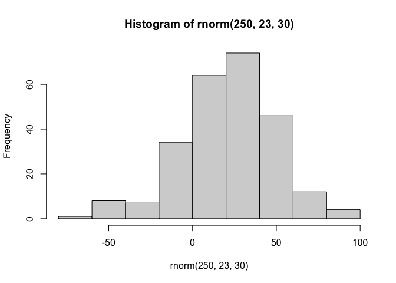

# Class 07 - Machine Learning pt. 1
Gabriella Tanoto (A18024184)

- [Clustering](#clustering)
  - [K-Means](#k-means)
- [Hierarchical Clustering](#hierarchical-clustering)
- [Dimentional Reduction](#dimentional-reduction)
  - [PCA (Principal Component
    Analysis)](#pca-principal-component-analysis)

Today, we are exploring unsupervised machine learning starting with
*clustering* and *dimentionality reduction*!

## Clustering

Let’s make a data where we know what the answer should be, just to get
used to the function and see if it works! The `rnorm()` function will
help us.

``` r
hist(rnorm(250, 23, 30))
```



Return 30 numbers centered at -3

``` r
c(rnorm(30, -3), rnorm(30, 3))
```

     [1] -2.0990803 -3.3707428 -3.1918080 -4.8993872 -3.1462718 -1.7265778
     [7] -3.8359433 -2.0930423 -4.4789081 -0.9203859 -1.8599293 -3.2654373
    [13] -1.9821393 -1.6010395 -2.7356000 -3.9693070 -2.8719461 -3.2643885
    [19] -4.6226817 -2.6368640 -3.3000369 -3.5590370 -4.3988211 -0.9847958
    [25] -0.5496288 -3.1625436 -3.1173891 -2.7854962 -3.7779713 -3.8887346
    [31]  0.7403081  1.3583250  4.7049838  3.0146464  3.2702738  2.0509809
    [37]  4.6850553  2.0852783  1.6983141  2.0570606  1.6361157  3.3006265
    [43]  2.8473445  3.8305589  2.9731482  4.3587197  1.9041943  3.3614878
    [49]  3.0126922  4.0584181  2.6810787  3.6057826  3.0959467  3.9351708
    [55]  3.4123768  2.6983727  3.9702327  3.0108096  2.9660928  2.0882801

``` r
#same as:
tmp <- tmp <-  c(rnorm(30,-3), rnorm(30,3))
x <-  cbind(x=tmp, y=rev(tmp))
```

Now, make this into a Plot:

``` r
plot(x)
```


### K-Means

Main functuion in “base R” for K-mean clustering is called `kmeans()`

``` r
km <- kmeans(x, centers=2) #centers refers to how many groups we want it to give us.
  #clustering vector is which cluster each of the points are at (i.e., cluster 1 or 2). 
km
```

    K-means clustering with 2 clusters of sizes 30, 30

    Cluster means:
              x         y
    1 -2.980325  3.392475
    2  3.392475 -2.980325

    Clustering vector:
     [1] 1 1 1 1 1 1 1 1 1 1 1 1 1 1 1 1 1 1 1 1 1 1 1 1 1 1 1 1 1 1 2 2 2 2 2 2 2 2
    [39] 2 2 2 2 2 2 2 2 2 2 2 2 2 2 2 2 2 2 2 2 2 2

    Within cluster sum of squares by cluster:
    [1] 60.37997 60.37997
     (between_SS / total_SS =  91.0 %)

    Available components:

    [1] "cluster"      "centers"      "totss"        "withinss"     "tot.withinss"
    [6] "betweenss"    "size"         "iter"         "ifault"      

The `kmeans()` function returns a list of 9 components. We can see the
attributes from `attributes()` function!

``` r
#Look at the attributes of the Km:
attributes(km)
```

    $names
    [1] "cluster"      "centers"      "totss"        "withinss"     "tot.withinss"
    [6] "betweenss"    "size"         "iter"         "ifault"      

    $class
    [1] "kmeans"

> Q1. How many points are in each cluster?

``` r
km$size
```

    [1] 30 30

> Q2. Cluster assignment/mamber vector?

``` r
km$cluster
```

     [1] 1 1 1 1 1 1 1 1 1 1 1 1 1 1 1 1 1 1 1 1 1 1 1 1 1 1 1 1 1 1 2 2 2 2 2 2 2 2
    [39] 2 2 2 2 2 2 2 2 2 2 2 2 2 2 2 2 2 2 2 2 2 2

``` r
#cluster: It's telling us which pints belong to which clusters.
```

> Q3. Cluster Centers?

``` r
km$centers
```

              x         y
    1 -2.980325  3.392475
    2  3.392475 -2.980325

> Q4. Make a plot of our `kmeans()` results, with cluster assignment
> different colors, and centers blue.

``` r
plot(x, col=km$cluster) + points(km$centers, col="blue", pch=19) 
```


    integer(0)

> Q5. Run `k-means` again on `x`, but with 4 groups cluster, and plot
> the same result fig as above.

``` r
km4 <- kmeans(x, centers= 4)
km4
```

    K-means clustering with 4 clusters of sizes 13, 17, 13, 17

    Cluster means:
              x         y
    1  3.100658 -1.877864
    2 -3.823384  3.615629
    3 -1.877864  3.100658
    4  3.615629 -3.823384

    Clustering vector:
     [1] 2 2 2 3 2 3 3 2 2 2 3 2 3 3 3 2 3 2 2 3 2 3 3 2 2 3 2 2 2 3 1 4 4 4 1 4 4 1
    [39] 1 4 1 4 4 1 4 1 1 1 4 1 4 4 4 1 1 4 1 4 4 4

    Within cluster sum of squares by cluster:
    [1] 14.86018 15.68300 14.86018 15.68300
     (between_SS / total_SS =  95.4 %)

    Available components:

    [1] "cluster"      "centers"      "totss"        "withinss"     "tot.withinss"
    [6] "betweenss"    "size"         "iter"         "ifault"      

``` r
#Plotting km4
plot(x, col= km4$cluster) + points(km4$centers, col="blue", pch=19)
```


    integer(0)

> Key point - **BE WARY**:  
> Kmeans is super popular because it’s easy to understand, but it can be
> **self-fulfilling and MISUSED**. One big limitation is: it can impose
> a clustering pattern even if natural grouping doesn’t exist.  
> We can just cluster anything into what we think it is, when we
> determine the `centers`. Say, even though it’s only 2 clusters, we put
> in 4 and it still gives out a result.

## Hierarchical Clustering

Main function in base R is `hclust()`.

You can’t just pass the dataset as is into `hclust()`. We have to make a
*distance matrix* (dissimilarity distance) first. But this makes it more
flexible (doesn’t have to be Euclidean distances only like the
`kmeans()`). Flexible as in we can do sequence alignments too!

``` r
d <- dist(x)
hc <- hclust(d)
hc #not very useful without plotting it. 
```


    Call:
    hclust(d = d)

    Cluster method   : complete 
    Distance         : euclidean 
    Number of objects: 60 

The results of `hclust()` doesn’t have very useful `print` method, but
it has special `plot()` method. Will give out a “dendrogram” or a “tree
diagram”.

``` r
plot(hc) +   #each labels here #each labels here is just the data label.
  abline(h=8, col = "#E74C3C")
```


    integer(0)

`hclust()` is a bottom-up clustering method.

To get our main cluster assignment (membership vector), we need to `cut`
our tree.

``` r
groups <- cutree(hc, h=8)
groups
```

     [1] 1 1 1 1 1 1 1 1 1 1 1 1 1 1 1 1 1 1 1 1 1 1 1 1 1 1 1 1 1 1 2 2 2 2 2 2 2 2
    [39] 2 2 2 2 2 2 2 2 2 2 2 2 2 2 2 2 2 2 2 2 2 2

We can see the attributes of `groups` by using `table()`

``` r
table(groups)
```

    groups
     1  2 
    30 30 

Plotting the same one (Q4) where we determine the colors of the
clusters:

``` r
plot(x, col= groups)
```


**Hierarchical clusterng** is distinct, in that the dendogram (tree
figure) can reveal the *potential groupings* in our data, unlike
K-means.

## Dimentional Reduction

### PCA (Principal Component Analysis)

PC is a common and useful dimentionality reduction technique used in
many fields, particularly Bioinformatics. It basically lines that are of
*best fit* for our data. So these PC lines are better at representind
the data points compared to any of the original axes.

PC’s capture the “spread” of the data. The PC1 axis will capture the
most variation, followed by the PC2, etc.

**Objectives of PC:**

- Reduce dimentionality
- Choose most useful characters

Basically like a filter!

#### Analyzing the UK food data:

Importing the File:

``` r
url <- "https://tinyurl.com/UK-foods"
uk <- read.csv(url, row.names = 1) #this row.names is a function that sets the first column into row names.
head(uk, 6)
```

                   England Wales Scotland N.Ireland
    Cheese             105   103      103        66
    Carcass_meat       245   227      242       267
    Other_meat         685   803      750       586
    Fish               147   160      122        93
    Fats_and_oils      193   235      184       209
    Sugars             156   175      147       139

Now, let’s try plotting them.

> Barplot

``` r
barplot(as.matrix(uk), beside=T, col=rainbow(nrow(uk)))
```


> Stacked barplot

``` r
barplot(as.matrix(uk), beside=F, col=rainbow(nrow(uk)))
```


> Pairs Plot  
> Now a more useful plot!

``` r
pairs(uk, col=rainbow(10), pch=16)
```


#### PCA to the Rescue!

The main function in R for PCA: `prcomp()`

``` r
t(uk) #transposing the data, so we have the columns as the food type.
```

              Cheese Carcass_meat  Other_meat  Fish Fats_and_oils  Sugars
    England      105           245         685  147            193    156
    Wales        103           227         803  160            235    175
    Scotland     103           242         750  122            184    147
    N.Ireland     66           267         586   93            209    139
              Fresh_potatoes  Fresh_Veg  Other_Veg  Processed_potatoes 
    England               720        253        488                 198
    Wales                 874        265        570                 203
    Scotland              566        171        418                 220
    N.Ireland            1033        143        355                 187
              Processed_Veg  Fresh_fruit  Cereals  Beverages Soft_drinks 
    England              360         1102     1472        57         1374
    Wales                365         1137     1582        73         1256
    Scotland             337          957     1462        53         1572
    N.Ireland            334          674     1494        47         1506
              Alcoholic_drinks  Confectionery 
    England                 375             54
    Wales                   475             64
    Scotland                458             62
    N.Ireland               135             41

``` r
pca <- prcomp(t(uk))
summary(pca)
```

    Importance of components:
                                PC1      PC2      PC3       PC4
    Standard deviation     324.1502 212.7478 73.87622 3.176e-14
    Proportion of Variance   0.6744   0.2905  0.03503 0.000e+00
    Cumulative Proportion    0.6744   0.9650  1.00000 1.000e+00

PC1 is the one that will catch most variation. This makes sense, since
**67%** of Proportion of Variance is captured by PC1, and *29%* is
captured by the PC2.

The `prcomp()` function returns a list of object of our results with 5
attributes/components.

``` r
attributes (pca)
```

    $names
    [1] "sdev"     "rotation" "center"   "scale"    "x"       

    $class
    [1] "prcomp"

``` r
head(pca$x)
```

                     PC1         PC2        PC3           PC4
    England   -144.99315   -2.532999 105.768945 -4.894696e-14
    Wales     -240.52915 -224.646925 -56.475555  5.700024e-13
    Scotland   -91.86934  286.081786 -44.415495 -7.460785e-13
    N.Ireland  477.39164  -58.901862  -4.877895  2.321303e-13

The two main results in here are: `pca$x` and `pca$rotation`. The
`pca$x` contains scores of fata on the new PC axis – we use these to
make the “PCA plot”

``` r
library(ggplot2)
library(ggrepel)

#make a plot of pca$x of PC1 v PC2
ggplot(pca$x)+
  aes (PC1, PC2, label= rownames(pca$x))+
  geom_point()+
  geom_text_repel()
```


> This plot mainly shows that Ireland consumes quite different foods
> than England, Wales, and Scotland. The PC1 shows highest variation,
> while the PC2 shows the second highest.

The second major result is contained in the pca\$rotation object or
component. Let’s plot to see what PCA is picking up.

``` r
head(pca$rotation, 4)
```

                          PC1         PC2         PC3          PC4
    Cheese        -0.05695538  0.01601285  0.02394295 -0.694538519
    Carcass_meat   0.04792763  0.01391582  0.06367111  0.489884628
    Other_meat    -0.25891666 -0.01533114 -0.55384854  0.279023718
    Fish          -0.08441498 -0.05075495  0.03906481 -0.008483145

Each factor (the food) contribution to the PC1 (the new axis!):

``` r
ggplot(pca$rotation)+
  aes(PC1, rownames(pca$rotation))+
  geom_col()
```


> This second plot shows how much each of the food types contribute to
> the PC; how much they affect the variance!

**UNDERSTANDING THE TWO PLOTS**:

> Combined with the previous plot (L: Ireland, R: England, Wales, and
> Scots), the two shows that Ireland eats more fresh potatoes and soft
> drinks, but the Fresh fruit adn alcoholic drinks are less consumed
> there.
