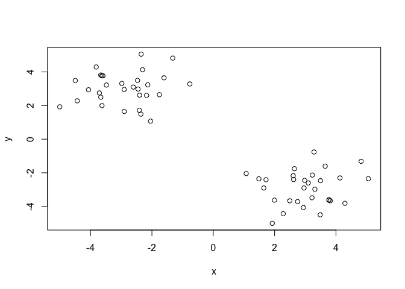
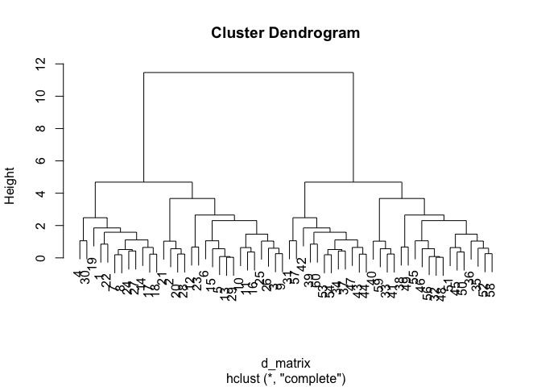
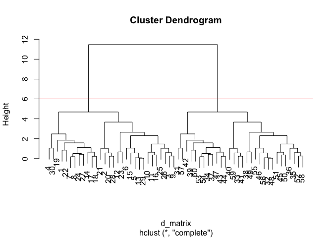
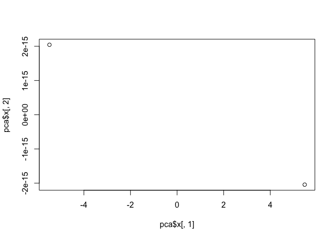
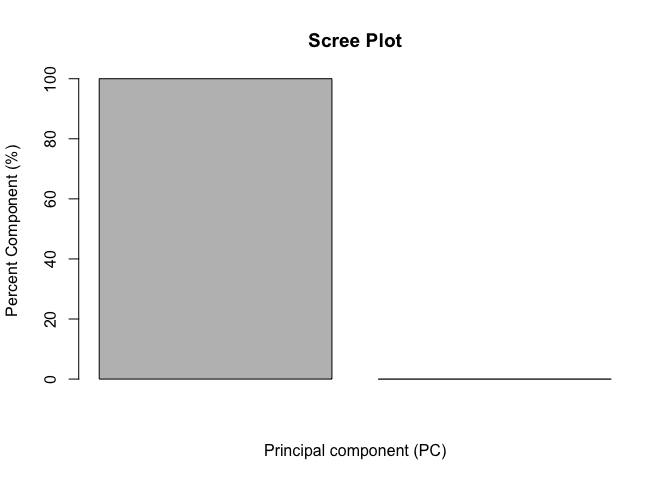

# K-Means vid lecture
Gabriella Tanoto (A18024184)

# K-MEANS

``` r
tmp <-  c(rnorm(30,-3), rnorm(30,3))
x <-  cbind(x=tmp, y=rev(tmp))

plot(x)
```



> Q. How many pts is in each cluster?

``` r
k <- kmeans(x, centers=2)
k
```

    K-means clustering with 2 clusters of sizes 30, 30

    Cluster means:
              x         y
    1 -2.905268  3.017904
    2  3.017904 -2.905268

    Clustering vector:
     [1] 1 1 1 1 1 1 1 1 1 1 1 1 1 1 1 1 1 1 1 1 1 1 1 1 1 1 1 1 1 1 2 2 2 2 2 2 2 2
    [39] 2 2 2 2 2 2 2 2 2 2 2 2 2 2 2 2 2 2 2 2 2 2

    Within cluster sum of squares by cluster:
    [1] 55.48574 55.48574
     (between_SS / total_SS =  90.5 %)

    Available components:

    [1] "cluster"      "centers"      "totss"        "withinss"     "tot.withinss"
    [6] "betweenss"    "size"         "iter"         "ifault"      

There are 30 points in each cluster, if we were to set `k=2`.

> Q. What `component` of your result object details: \# Cluster size? \#
> Cluster alignment/membership? \<- *not quite sure yet* \# Cluster
> center?

``` r
k[7] #for cluster size
```

    $size
    [1] 30 30

``` r
k[2] #for cluster's centers
```

    $centers
              x         y
    1 -2.905268  3.017904
    2  3.017904 -2.905268

Cluster size = 30 and 30 Cluster centers= **(-2.683190, 2.861095)** and
**(2.861095, -2.683190)**

> Q. Plot x colored by Kmeans cluster assignment and add cluster centers
> as blue points!

# Dendogram // Hierarchical Clustering

There are 2 types of hierarchical clustering: *Bottom-Up* and
*Top-Down*.

## Bottom-Up

1.  we make a distance matrix of our data `x`.

``` r
d_matrix <- dist(x)
```

2.  make the hierarchical clustering of the distance matrix.

``` r
hc <- hclust(d=d_matrix)
```

3.  make the plot!

``` r
plot(hc)
```



4.  we can add a horizontal line to cut into a designated number of
    groups (*\#K* groups)

``` r
plot(hc)+
  abline(h=6, col= "red")
```



    integer(0)

``` r
cutree(hc, k=2) #cutting the "tree" into 2 groups, will tell us which data is in which cluster # (i.e., 1 or 2)
```

     [1] 1 1 1 1 1 1 1 1 1 1 1 1 1 1 1 1 1 1 1 1 1 1 1 1 1 1 1 1 1 1 2 2 2 2 2 2 2 2
    [39] 2 2 2 2 2 2 2 2 2 2 2 2 2 2 2 2 2 2 2 2 2 2

# PCA examples

Call `prcomp()` to do PCA.

``` r
pca <- prcomp(t(x), scale = TRUE)
attributes(pca)
```

    $names
    [1] "sdev"     "rotation" "center"   "scale"    "x"       

    $class
    [1] "prcomp"

``` r
# Basic PC1 v. PC2 2D plot:
plot(pca$x[ ,1], pca$x[ ,2])
```



``` r
# Variance captured /PC
pca.var <- pca$sdev^2
pca.var.per <- round(pca.var/sum(pca.var)*100, 1)
barplot(pca.var.per, main = "Scree Plot", xlab = "Principal component (PC)", ylab = "Percent Component (%)")
```


