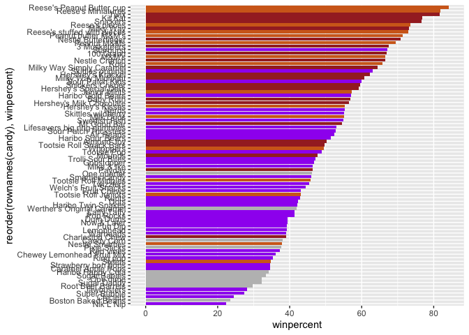

# Class9 - Halloween Mini Project
Gabriella Tanoto (A18024184)

- [1. Import Candy Data](#1-import-candy-data)
- [2. What is Your Favorite Candy](#2-what-is-your-favorite-candy)
  - [Exploratory Analysis](#exploratory-analysis)
- [3. Overall Candy Rankings](#3-overall-candy-rankings)
  - [MAKING A PLOT](#making-a-plot)
- [4. Winpercent Vs Price](#4-winpercent-vs-price)
- [5. Correlation Structure](#5-correlation-structure)
- [6. PCA](#6-pca)

Today, we are taking a lil step back so we can try out candies and
explore more of the correlation data :D

# 1. Import Candy Data

``` r
candy_file <- read.csv("candy-data.csv")
candy <- read.csv("candy-data.csv", row.names=1)
head(candy,5)
```

                 chocolate fruity caramel peanutyalmondy nougat crispedricewafer
    100 Grand            1      0       1              0      0                1
    3 Musketeers         1      0       0              0      1                0
    One dime             0      0       0              0      0                0
    One quarter          0      0       0              0      0                0
    Air Heads            0      1       0              0      0                0
                 hard bar pluribus sugarpercent pricepercent winpercent
    100 Grand       0   1        0        0.732        0.860   66.97173
    3 Musketeers    0   1        0        0.604        0.511   67.60294
    One dime        0   0        0        0.011        0.116   32.26109
    One quarter     0   0        0        0.011        0.511   46.11650
    Air Heads       0   0        0        0.906        0.511   52.34146

- ‘pluribus’ means the candy contains many inside (like the MnM’s or
  Skittles!) \*\* Comma separated files and TSV is the same

> Q1. How many different candy types are in this dataset?

There are **85** candy types.

``` r
nrow(candy)
```

    [1] 85

> Q2. How many fruity candy types are in the dataset?

There are about **38** candy types that are fruity.

``` r
sum(candy$fruity==T)
```

    [1] 38

# 2. What is Your Favorite Candy

> Q3. What is your favorite candy in the dataset and what is it’s
> winpercent value?

My favorite candy, Milky Way, wins **73.1%**.

``` r
candy["Milky Way",]$winpercent
```

    [1] 73.09956

> Q4. What is the winpercent value for “Kit Kat”?

KitKat’s win percent is **76.8%**!

``` r
candy["Kit Kat",]$winpercent
```

    [1] 76.7686

> Q5. What is the winpercent value for “Tootsie Roll Snack Bars”?

Tootsie Roll’s win percent is

``` r
candy["Tootsie Roll Snack Bars",]$winpercent
```

    [1] 49.6535

## Exploratory Analysis

We can use the skim package to get a quick overview of a given dataset.
This can be usefyl for the first time you see a new datset!

Use the `install.packages("skimr")`

``` r
skimr::skim(candy)
```

|                                                  |       |
|:-------------------------------------------------|:------|
| Name                                             | candy |
| Number of rows                                   | 85    |
| Number of columns                                | 12    |
| \_\_\_\_\_\_\_\_\_\_\_\_\_\_\_\_\_\_\_\_\_\_\_   |       |
| Column type frequency:                           |       |
| numeric                                          | 12    |
| \_\_\_\_\_\_\_\_\_\_\_\_\_\_\_\_\_\_\_\_\_\_\_\_ |       |
| Group variables                                  | None  |

Data summary

**Variable type: numeric**

| skim_variable | n_missing | complete_rate | mean | sd | p0 | p25 | p50 | p75 | p100 | hist |
|:---|---:|---:|---:|---:|---:|---:|---:|---:|---:|:---|
| chocolate | 0 | 1 | 0.44 | 0.50 | 0.00 | 0.00 | 0.00 | 1.00 | 1.00 | ▇▁▁▁▆ |
| fruity | 0 | 1 | 0.45 | 0.50 | 0.00 | 0.00 | 0.00 | 1.00 | 1.00 | ▇▁▁▁▆ |
| caramel | 0 | 1 | 0.16 | 0.37 | 0.00 | 0.00 | 0.00 | 0.00 | 1.00 | ▇▁▁▁▂ |
| peanutyalmondy | 0 | 1 | 0.16 | 0.37 | 0.00 | 0.00 | 0.00 | 0.00 | 1.00 | ▇▁▁▁▂ |
| nougat | 0 | 1 | 0.08 | 0.28 | 0.00 | 0.00 | 0.00 | 0.00 | 1.00 | ▇▁▁▁▁ |
| crispedricewafer | 0 | 1 | 0.08 | 0.28 | 0.00 | 0.00 | 0.00 | 0.00 | 1.00 | ▇▁▁▁▁ |
| hard | 0 | 1 | 0.18 | 0.38 | 0.00 | 0.00 | 0.00 | 0.00 | 1.00 | ▇▁▁▁▂ |
| bar | 0 | 1 | 0.25 | 0.43 | 0.00 | 0.00 | 0.00 | 0.00 | 1.00 | ▇▁▁▁▂ |
| pluribus | 0 | 1 | 0.52 | 0.50 | 0.00 | 0.00 | 1.00 | 1.00 | 1.00 | ▇▁▁▁▇ |
| sugarpercent | 0 | 1 | 0.48 | 0.28 | 0.01 | 0.22 | 0.47 | 0.73 | 0.99 | ▇▇▇▇▆ |
| pricepercent | 0 | 1 | 0.47 | 0.29 | 0.01 | 0.26 | 0.47 | 0.65 | 0.98 | ▇▇▇▇▆ |
| winpercent | 0 | 1 | 50.32 | 14.71 | 22.45 | 39.14 | 47.83 | 59.86 | 84.18 | ▃▇▆▅▂ |

> Q6. Is there any variable/column that looks to be on a different scale
> to the majority of the other columns in the dataset?

Yes, there is. The data in the `skimr::skim()` and the `sd()` (below)
shows that `candy$winpercent` is in a different scale, indicating their
different value type (not a T / F).

Also can use standard deviation function:

``` r
sapply(candy, mean)
```

           chocolate           fruity          caramel   peanutyalmondy 
          0.43529412       0.44705882       0.16470588       0.16470588 
              nougat crispedricewafer             hard              bar 
          0.08235294       0.08235294       0.17647059       0.24705882 
            pluribus     sugarpercent     pricepercent       winpercent 
          0.51764706       0.47864705       0.46888235      50.31676381 

> Q7. What do you think a zero and one represent for the
> candy\$chocolate column?

A true or false value, whether the candy is chocolatey or not.

> Q8. Plot a histogram of winpercent values

``` r
hist(candy$winpercent) # ( ... ,breaks=) if we wanna change binwidth!
```


Or thru the ggplot2

``` r
library(ggplot2)

ggplot(candy)+
  aes(winpercent)+
  geom_histogram(bins=10)
```


> Q9. Is the distribution of winpercent values symmetrical?

Seemingly not, according to the histogram!

> Q10. Is the center of the distribution above or below 50%?

``` r
summary(candy$winpercent)
```

       Min. 1st Qu.  Median    Mean 3rd Qu.    Max. 
      22.45   39.14   47.83   50.32   59.86   84.18 

The median is lower than **50%**.

> Q11. On average is chocolate candy higher or lower ranked than fruit
> candy?

On average, *chocolate candies* have a *higher rank* than fruity candy.
Chocolate’s win pecent is 60.9% on average, while fruity candies’ are
44.1%.

``` r
chococandy <- candy$chocolate==TRUE
choc.info <- candy[chococandy, ]
choc.win <- choc.info$winpercent
mean(choc.win) #60.92153
```

    [1] 60.92153

``` r
fruity <- candy$fruity==TRUE
fruit.info <- candy[fruity, ]
fruit.win <- fruit.info$winpercent
mean(fruit.win) #44.11974
```

    [1] 44.11974

> Q12. Is this difference statistically significant?

Yes! According to the Welch t-test, it has a *statistically significant
difference* between the two. Chocolates are definitely more liked than
fruity candies!

``` r
ans <- t.test(choc.win, fruit.win)
```

It is different by the p-value of 0.

# 3. Overall Candy Rankings

> Q13. What are the five least liked candy types in this set?

There are 2 related functions we cna use: `sort()` and `order()`

``` r
x <- c(1, 5, 3, 10, 7)
sort(x, decreasing=F)
```

    [1]  1  3  5  7 10

``` r
order(x) #we can manipulate the actual data 
```

    [1] 1 3 2 5 4

``` r
inds <- order(candy$winpercent) #lowest to highest Win %.
candy[inds,1:5] #looking at the 1st five worst candies.
```

                                chocolate fruity caramel peanutyalmondy nougat
    Nik L Nip                           0      1       0              0      0
    Boston Baked Beans                  0      0       0              1      0
    Chiclets                            0      1       0              0      0
    Super Bubble                        0      1       0              0      0
    Jawbusters                          0      1       0              0      0
    Root Beer Barrels                   0      0       0              0      0
    Sugar Daddy                         0      0       1              0      0
    One dime                            0      0       0              0      0
    Sugar Babies                        0      0       1              0      0
    Haribo Happy Cola                   0      0       0              0      0
    Caramel Apple Pops                  0      1       1              0      0
    Strawberry bon bons                 0      1       0              0      0
    Sixlets                             1      0       0              0      0
    Ring pop                            0      1       0              0      0
    Chewey Lemonhead Fruit Mix          0      1       0              0      0
    Red vines                           0      1       0              0      0
    Pixie Sticks                        0      0       0              0      0
    Nestle Smarties                     1      0       0              0      0
    Candy Corn                          0      0       0              0      0
    Charleston Chew                     1      0       0              0      1
    Warheads                            0      1       0              0      0
    Lemonhead                           0      1       0              0      0
    Fun Dip                             0      1       0              0      0
    Now & Later                         0      1       0              0      0
    Dum Dums                            0      1       0              0      0
    Pop Rocks                           0      1       0              0      0
    Laffy Taffy                         0      1       0              0      0
    Werther's Original Caramel          0      0       1              0      0
    Haribo Twin Snakes                  0      1       0              0      0
    Dots                                0      1       0              0      0
    Runts                               0      1       0              0      0
    Tootsie Roll Juniors                1      0       0              0      0
    Fruit Chews                         0      1       0              0      0
    Welch's Fruit Snacks                0      1       0              0      0
    Twizzlers                           0      1       0              0      0
    Tootsie Roll Midgies                1      0       0              0      0
    Smarties candy                      0      1       0              0      0
    One quarter                         0      0       0              0      0
    Payday                              0      0       0              1      1
    Mike & Ike                          0      1       0              0      0
    Gobstopper                          0      1       0              0      0
    Trolli Sour Bites                   0      1       0              0      0
    Mounds                              1      0       0              0      0
    Tootsie Pop                         1      1       0              0      0
    Whoppers                            1      0       0              0      0
    Tootsie Roll Snack Bars             1      0       0              0      0
    Almond Joy                          1      0       0              1      0
    Haribo Sour Bears                   0      1       0              0      0
    Air Heads                           0      1       0              0      0
    Sour Patch Tricksters               0      1       0              0      0
    Lifesavers big ring gummies         0      1       0              0      0
    Mr Good Bar                         1      0       0              1      0
    Swedish Fish                        0      1       0              0      0
    Milk Duds                           1      0       1              0      0
    Skittles wildberry                  0      1       0              0      0
    Nerds                               0      1       0              0      0
    Hershey's Kisses                    1      0       0              0      0
    Hershey's Milk Chocolate            1      0       0              0      0
    Baby Ruth                           1      0       1              1      1
    Haribo Gold Bears                   0      1       0              0      0
    Junior Mints                        1      0       0              0      0
    Hershey's Special Dark              1      0       0              0      0
    Snickers Crisper                    1      0       1              1      0
    Sour Patch Kids                     0      1       0              0      0
    Milky Way Midnight                  1      0       1              0      1
    Hershey's Krackel                   1      0       0              0      0
    Skittles original                   0      1       0              0      0
    Milky Way Simply Caramel            1      0       1              0      0
    Rolo                                1      0       1              0      0
    Nestle Crunch                       1      0       0              0      0
    M&M's                               1      0       0              0      0
    100 Grand                           1      0       1              0      0
    Starburst                           0      1       0              0      0
    3 Musketeers                        1      0       0              0      1
    Peanut M&Ms                         1      0       0              1      0
    Nestle Butterfinger                 1      0       0              1      0
    Peanut butter M&M's                 1      0       0              1      0
    Reese's stuffed with pieces         1      0       0              1      0
    Milky Way                           1      0       1              0      1
    Reese's pieces                      1      0       0              1      0
    Snickers                            1      0       1              1      1
    Kit Kat                             1      0       0              0      0
    Twix                                1      0       1              0      0
    Reese's Miniatures                  1      0       0              1      0
    Reese's Peanut Butter cup           1      0       0              1      0

> Q14. What are the top 5 all time favorite candy types out of this set?

``` r
winners <- order(candy$winpercent, decreasing= T) #big to small win%
candy[winners, 1:5]
```

                                chocolate fruity caramel peanutyalmondy nougat
    Reese's Peanut Butter cup           1      0       0              1      0
    Reese's Miniatures                  1      0       0              1      0
    Twix                                1      0       1              0      0
    Kit Kat                             1      0       0              0      0
    Snickers                            1      0       1              1      1
    Reese's pieces                      1      0       0              1      0
    Milky Way                           1      0       1              0      1
    Reese's stuffed with pieces         1      0       0              1      0
    Peanut butter M&M's                 1      0       0              1      0
    Nestle Butterfinger                 1      0       0              1      0
    Peanut M&Ms                         1      0       0              1      0
    3 Musketeers                        1      0       0              0      1
    Starburst                           0      1       0              0      0
    100 Grand                           1      0       1              0      0
    M&M's                               1      0       0              0      0
    Nestle Crunch                       1      0       0              0      0
    Rolo                                1      0       1              0      0
    Milky Way Simply Caramel            1      0       1              0      0
    Skittles original                   0      1       0              0      0
    Hershey's Krackel                   1      0       0              0      0
    Milky Way Midnight                  1      0       1              0      1
    Sour Patch Kids                     0      1       0              0      0
    Snickers Crisper                    1      0       1              1      0
    Hershey's Special Dark              1      0       0              0      0
    Junior Mints                        1      0       0              0      0
    Haribo Gold Bears                   0      1       0              0      0
    Baby Ruth                           1      0       1              1      1
    Hershey's Milk Chocolate            1      0       0              0      0
    Hershey's Kisses                    1      0       0              0      0
    Nerds                               0      1       0              0      0
    Skittles wildberry                  0      1       0              0      0
    Milk Duds                           1      0       1              0      0
    Swedish Fish                        0      1       0              0      0
    Mr Good Bar                         1      0       0              1      0
    Lifesavers big ring gummies         0      1       0              0      0
    Sour Patch Tricksters               0      1       0              0      0
    Air Heads                           0      1       0              0      0
    Haribo Sour Bears                   0      1       0              0      0
    Almond Joy                          1      0       0              1      0
    Tootsie Roll Snack Bars             1      0       0              0      0
    Whoppers                            1      0       0              0      0
    Tootsie Pop                         1      1       0              0      0
    Mounds                              1      0       0              0      0
    Trolli Sour Bites                   0      1       0              0      0
    Gobstopper                          0      1       0              0      0
    Mike & Ike                          0      1       0              0      0
    Payday                              0      0       0              1      1
    One quarter                         0      0       0              0      0
    Smarties candy                      0      1       0              0      0
    Tootsie Roll Midgies                1      0       0              0      0
    Twizzlers                           0      1       0              0      0
    Welch's Fruit Snacks                0      1       0              0      0
    Fruit Chews                         0      1       0              0      0
    Tootsie Roll Juniors                1      0       0              0      0
    Runts                               0      1       0              0      0
    Dots                                0      1       0              0      0
    Haribo Twin Snakes                  0      1       0              0      0
    Werther's Original Caramel          0      0       1              0      0
    Laffy Taffy                         0      1       0              0      0
    Pop Rocks                           0      1       0              0      0
    Dum Dums                            0      1       0              0      0
    Now & Later                         0      1       0              0      0
    Fun Dip                             0      1       0              0      0
    Lemonhead                           0      1       0              0      0
    Warheads                            0      1       0              0      0
    Charleston Chew                     1      0       0              0      1
    Candy Corn                          0      0       0              0      0
    Nestle Smarties                     1      0       0              0      0
    Pixie Sticks                        0      0       0              0      0
    Red vines                           0      1       0              0      0
    Chewey Lemonhead Fruit Mix          0      1       0              0      0
    Ring pop                            0      1       0              0      0
    Sixlets                             1      0       0              0      0
    Strawberry bon bons                 0      1       0              0      0
    Caramel Apple Pops                  0      1       1              0      0
    Haribo Happy Cola                   0      0       0              0      0
    Sugar Babies                        0      0       1              0      0
    One dime                            0      0       0              0      0
    Sugar Daddy                         0      0       1              0      0
    Root Beer Barrels                   0      0       0              0      0
    Jawbusters                          0      1       0              0      0
    Super Bubble                        0      1       0              0      0
    Chiclets                            0      1       0              0      0
    Boston Baked Beans                  0      0       0              1      0
    Nik L Nip                           0      1       0              0      0

### MAKING A PLOT

> Q15. Make a first barplot of candy ranking based on winpercent values.

1.  Plotting the winpercent values!

``` r
ggplot(candy)+
  aes(winpercent, rownames(candy))+
  geom_col()
```


> Q16. This is quite ugly, use the reorder() function to get the bars
> sorted by winpercent?

So now… go to step no. 2:

2.  Reorder by the winpercent values.

``` r
ggplot(candy)+
  aes(winpercent, 
      reorder(rownames(candy), winpercent))+
  geom_col()
```


3.  Color it by the tyes of candy!

``` r
ggplot(candy)+
  aes(x = winpercent, 
      y= reorder(rownames(candy), winpercent), 
      fill=chocolate)+
  geom_col()
```


From this, we only get which one is chocolate and which isn’t. But we
want a better capture, where we can see the colors differently along
different types of candy! We want a custom color vector to color each
bar columns!

``` r
mycols <- rep("grey", nrow(candy))
mycols[as.logical(candy$chocolate)] <- "chocolate"
mycols[as.logical(candy$fruity)] <- "purple"
mycols[as.logical(candy$bar)] <- "brown"

ggplot(candy)+
  aes(x = winpercent, 
      y= reorder(rownames(candy), winpercent))+
  geom_col(fill=mycols)
```



``` r
ggsave("mybarplot.png", width= 4, height=8)
```

Include the saved plot:  \> Q17. What is the worst
ranked chocolate candy?

It is *Sixlets*.

> Q18. What is the best ranked fruity candy?

It is *Starburst*.

# 4. Winpercent Vs Price

``` r
library(ggrepel)

ggplot(candy)+
  aes(x= winpercent,
      y= pricepercent,
      label= rownames(candy))+
  geom_text_repel(color=mycols)+
  geom_point(color=mycols, max.overlaps=6)
```

    Warning in geom_point(color = mycols, max.overlaps = 6): Ignoring unknown
    parameters: `max.overlaps`

    Warning: ggrepel: 29 unlabeled data points (too many overlaps). Consider
    increasing max.overlaps


> Q19. Which candy type is the highest ranked in terms of winpercent for
> the least money - i.e. offers the most bang for your buck?

According to this new plot, it would be **Reeses’ Miniatures** (bottom
right), as it is low on the price (y-axis) but high in the preferrence/
win% (x-axis)!

> Q20. What are the top 5 most expensive candy types in the dataset and
> of these which is the least popular?

``` r
expensive <- order(candy$pricepercent, decreasing=T)
exp.candy <- candy[expensive,]
head(exp.candy, 5)
```

                             chocolate fruity caramel peanutyalmondy nougat
    Nik L Nip                        0      1       0              0      0
    Nestle Smarties                  1      0       0              0      0
    Ring pop                         0      1       0              0      0
    Hershey's Krackel                1      0       0              0      0
    Hershey's Milk Chocolate         1      0       0              0      0
                             crispedricewafer hard bar pluribus sugarpercent
    Nik L Nip                               0    0   0        1        0.197
    Nestle Smarties                         0    0   0        1        0.267
    Ring pop                                0    1   0        0        0.732
    Hershey's Krackel                       1    0   1        0        0.430
    Hershey's Milk Chocolate                0    0   1        0        0.430
                             pricepercent winpercent
    Nik L Nip                       0.976   22.44534
    Nestle Smarties                 0.976   37.88719
    Ring pop                        0.965   35.29076
    Hershey's Krackel               0.918   62.28448
    Hershey's Milk Chocolate        0.918   56.49050

The most expensive candies are: *Nik L Nip, Nestle Smarties, Ring Pop,
Hershey’s Krackel, and Hershey’s Milk Chocolate*, with **Nic n Lip**
being the least popular of all.

#### OPTIONAL Q21

> Q21. Make a barplot again with geom_col() this time using pricepercent
> and then improve this step by step, first ordering the x-axis by value
> and finally making a so called “dot chat” or “lollipop” chart by
> swapping geom_col() for geom_point() + geom_segment().

``` r
#ordering by price, so we'd use the `expensive` order

ggplot(candy) + 
  aes(x= pricepercent, y= reorder(rownames(candy), pricepercent))+
  geom_col()
```


``` r
ggplot(candy) + 
  aes(x= pricepercent, y= reorder(rownames(candy), pricepercent), xend=0)+
  geom_point(shape=10)+geom_segment(col="magenta")
```


# 5. Correlation Structure

``` r
cij <-  cor(candy)
head(cij,4) # chocolate and fruit has very opposite value, meaning: Chocolate dont go together with Fruity.
```

                    chocolate     fruity     caramel peanutyalmondy     nougat
    chocolate       1.0000000 -0.7417211  0.24987535     0.37782357  0.2548918
    fruity         -0.7417211  1.0000000 -0.33548538    -0.39928014 -0.2693671
    caramel         0.2498753 -0.3354854  1.00000000     0.05935614  0.3284928
    peanutyalmondy  0.3778236 -0.3992801  0.05935614     1.00000000  0.2131131
                   crispedricewafer       hard        bar   pluribus sugarpercent
    chocolate            0.34120978 -0.3441769  0.5974211 -0.3396752   0.10416906
    fruity              -0.26936712  0.3906775 -0.5150656  0.2997252  -0.03439296
    caramel              0.21311310 -0.1223551  0.3339600 -0.2695850   0.22193335
    peanutyalmondy      -0.01764631 -0.2055566  0.2604196 -0.2061093   0.08788927
                   pricepercent winpercent
    chocolate         0.5046754  0.6365167
    fruity           -0.4309685 -0.3809381
    caramel           0.2543271  0.2134163
    peanutyalmondy    0.3091532  0.4061922

``` r
library(corrplot)
```

    corrplot 0.95 loaded

``` r
corrplot(cij)
```


> Q22. Examining this plot what two variables are anti-correlated
> (i.e. have minus values)?

Chocolate and Fruity are negatively correlated!

``` r
round(cij["chocolate","fruity"], 2)
```

    [1] -0.74

> Q23. Similarly, what two variables are most positively correlated?

Chocolate and bar seems to be positively correlated.

``` r
round(cij["chocolate", "bar"], 2)
```

    [1] 0.6

# 6. PCA

We need to be sure to scale the input `candy` data before PCA, because
we have the `winpercent` column on a different scale than the others.

``` r
pca <- prcomp(candy, scale=T)
summary(pca) #PC1 covers 36% whereas 3 PC's cover 57% of the variance in the data
```

    Importance of components:
                              PC1    PC2    PC3     PC4    PC5     PC6     PC7
    Standard deviation     2.0788 1.1378 1.1092 1.07533 0.9518 0.81923 0.81530
    Proportion of Variance 0.3601 0.1079 0.1025 0.09636 0.0755 0.05593 0.05539
    Cumulative Proportion  0.3601 0.4680 0.5705 0.66688 0.7424 0.79830 0.85369
                               PC8     PC9    PC10    PC11    PC12
    Standard deviation     0.74530 0.67824 0.62349 0.43974 0.39760
    Proportion of Variance 0.04629 0.03833 0.03239 0.01611 0.01317
    Cumulative Proportion  0.89998 0.93832 0.97071 0.98683 1.00000

First main result figure: “PCA Plot”

``` r
ggplot(pca$x)+
  aes(PC1, PC2, label= rownames(candy))+
  geom_point(col= mycols)+
  geom_text_repel(col= mycols, max.overlaps=6)+
  theme_bw()+
  ggtitle("PCA of Halloween Candy")
```

    Warning: ggrepel: 44 unlabeled data points (too many overlaps). Consider
    increasing max.overlaps


Second main result of PCA plot is in the `pca$rotation`… how what does
PC1 contain?

``` r
head(pca$rotation)
```

                            PC1         PC2         PC3          PC4         PC5
    chocolate        -0.4019466  0.21404160  0.01601358 -0.016673032  0.06603585
    fruity            0.3683883 -0.18304666 -0.13765612 -0.004479829  0.14353533
    caramel          -0.2299709 -0.40349894 -0.13294166 -0.024889542 -0.50730150
    peanutyalmondy   -0.2407155  0.22446919  0.18272802  0.466784287  0.39993025
    nougat           -0.2268102 -0.47016599  0.33970244  0.299581403 -0.18885242
    crispedricewafer -0.2215182  0.09719527 -0.36485542 -0.605594730  0.03465232
                             PC6         PC7        PC8          PC9        PC10
    chocolate        -0.09018950 -0.08360642 -0.4908486 -0.151651568  0.10766136
    fruity           -0.04266105  0.46147889  0.3980580 -0.001248306  0.36206250
    caramel          -0.40346502 -0.44274741  0.2696345  0.019186442  0.22979901
    peanutyalmondy   -0.09416259 -0.25710489  0.4577145  0.381068550 -0.14591236
    nougat            0.09012643  0.36663902 -0.1879396  0.385278987  0.01132345
    crispedricewafer -0.09007640  0.13077042  0.1356774  0.511634999 -0.26481014
                           PC11       PC12
    chocolate         0.1004528 0.69784924
    fruity            0.1749490 0.50624242
    caramel           0.1351582 0.07548984
    peanutyalmondy    0.1124428 0.12972756
    nougat           -0.3895447 0.09223698
    crispedricewafer -0.2261562 0.11727369

``` r
ggplot(pca$rotation)+
  aes (x=PC1,
       y= reorder(rownames(pca$rotation),PC1),
       fill = PC1)+
  geom_col()
```


PCA is so useful because it quickly summarizes the whole thing. If
you’re a chocolate bar, you tend to have nougat and caramel and a higher
win%. You are also unlikely to be fruity – just like what we found from
the previous part using the correlation plot/

> Q24. What original variables are picked up strongly by PC1 in the
> positive direction? Do these make sense to you?

The main ones contributing for a positive PC1 are fruity, pluribus, and
harder candies! It makes sense, because it is all related to another,
fruity candies are usually pluribus (like skittles) or they are hard
candies.

Note to self: The very top and very bottom of the ordered list are ones
most important in causing the variability of the whole dataset.
