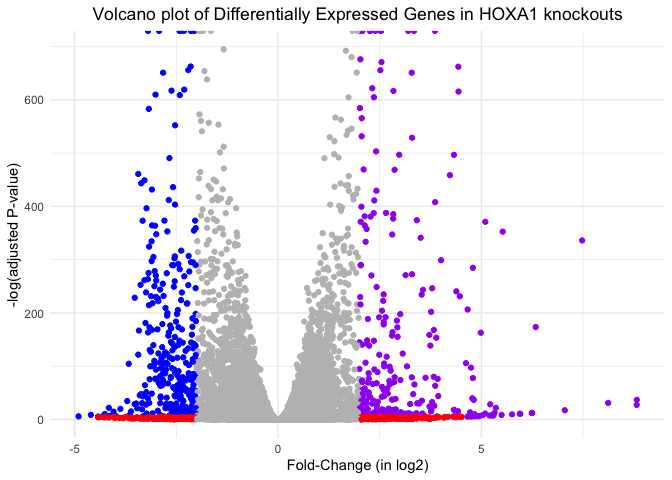

# Class14 - RNA Seq Mini-Project
Gabriella Tanoto (A18024184)

- [Load Packages](#load-packages)
- [Data Import](#data-import)
- [TIdying up our datasets](#tidying-up-our-datasets)
- [Remove the 0 count genes](#remove-the-0-count-genes)
- [Set up the DESeq object for
  analysis](#set-up-the-deseq-object-for-analysis)
- [Run the DESeq analysis](#run-the-deseq-analysis)
- [Extract the results](#extract-the-results)
- [Add the gene annotations](#add-the-gene-annotations)
- [Save the results to the CSV file](#save-the-results-to-the-csv-file)
- [Result visualization](#result-visualization)
- [Pathway Analysis](#pathway-analysis)
- [GO (Gene Ontology)](#go-gene-ontology)
- [Reactome Analysis](#reactome-analysis)
- [GO online](#go-online)

Here, we are performing a complete RNA-Seq analysis from counts to
pathways, and its biological interpretation.

The data for for hands-on session comes from GEO entry: GSE37704, which
is associated with the following publication:

> Trapnell C, Hendrickson DG, Sauvageau M, Goff L et al. “Differential
> analysis of gene regulation at transcript resolution with RNA-seq”.
> Nat Biotechnol 2013 Jan;31(1):46-53. PMID: 23222703

The authors report on differential analysis of lung fibroblasts in
response to loss of the developmental transcription factor HOXA1. Their
results and others indicate that HOXA1 is required for lung fibroblast
and HeLa cell cycle progression.

# Load Packages

Load up our packages:

``` r
library(DESeq2)
library(AnnotationDbi)
library(org.Hs.eg.db)
library(pathview)
library(gage)
library(gageData)
library(ggplot2)
```

# Data Import

Let’s input our data:

``` r
colData <- read.csv("GSE37704_metadata.csv", row.names = 1)
countData <- read.csv("GSE37704_featurecounts.csv", row.names = 1)
```

``` r
head(colData)
```

                  condition
    SRR493366 control_sirna
    SRR493367 control_sirna
    SRR493368 control_sirna
    SRR493369      hoxa1_kd
    SRR493370      hoxa1_kd
    SRR493371      hoxa1_kd

``` r
head(countData)
```

                    length SRR493366 SRR493367 SRR493368 SRR493369 SRR493370
    ENSG00000186092    918         0         0         0         0         0
    ENSG00000279928    718         0         0         0         0         0
    ENSG00000279457   1982        23        28        29        29        28
    ENSG00000278566    939         0         0         0         0         0
    ENSG00000273547    939         0         0         0         0         0
    ENSG00000187634   3214       124       123       205       207       212
                    SRR493371
    ENSG00000186092         0
    ENSG00000279928         0
    ENSG00000279457        46
    ENSG00000278566         0
    ENSG00000273547         0
    ENSG00000187634       258

# TIdying up our datasets

Check correspondence of the colData and countData columns:

``` r
rownames(colData)
```

    [1] "SRR493366" "SRR493367" "SRR493368" "SRR493369" "SRR493370" "SRR493371"

``` r
colnames(countData)
```

    [1] "length"    "SRR493366" "SRR493367" "SRR493368" "SRR493369" "SRR493370"
    [7] "SRR493371"

``` r
#We ask R if they match:
rownames(colData) == colnames(countData)
```

    Warning in rownames(colData) == colnames(countData): longer object length is
    not a multiple of shorter object length

    [1] FALSE FALSE FALSE FALSE FALSE FALSE FALSE

> Q. Getting rid of the length column:

``` r
counts <- countData[,-1]
```

Check again if they match now:

``` r
all(rownames(colData) == colnames(counts))
```

    [1] TRUE

# Remove the 0 count genes

> Q. We need to remove all the 0 counts genes:

We will have rows in `counts` for genes that we cannot say anything
about because they have 0 expression in the particular tissue we are
looking at. There’s no point in including them in our analysis.

``` r
head(counts)
```

                    SRR493366 SRR493367 SRR493368 SRR493369 SRR493370 SRR493371
    ENSG00000186092         0         0         0         0         0         0
    ENSG00000279928         0         0         0         0         0         0
    ENSG00000279457        23        28        29        29        28        46
    ENSG00000278566         0         0         0         0         0         0
    ENSG00000273547         0         0         0         0         0         0
    ENSG00000187634       124       123       205       207       212       258

If the rowSums() of the gene is 0 (have no count data), we should
exclude it.

``` r
include.genes <- rowSums(counts)!=0
cleancounts <- counts[include.genes, ]
```

> Q. How many genes do we have left?

``` r
nrow(cleancounts)
```

    [1] 15975

We have **15,975** genes left to analyze.

# Set up the DESeq object for analysis

``` r
dds <- DESeqDataSetFromMatrix(countData = cleancounts,
                              colData = colData,
                              design = ~condition)
```

    Warning in DESeqDataSet(se, design = design, ignoreRank): some variables in
    design formula are characters, converting to factors

# Run the DESeq analysis

``` r
dds <- DESeq(dds)
```

    estimating size factors

    estimating dispersions

    gene-wise dispersion estimates

    mean-dispersion relationship

    final dispersion estimates

    fitting model and testing

``` r
attributes(dds)
```

    $design
    ~condition

    $dispersionFunction
    function (q) 
    coefs[1] + coefs[2]/q
    <bytecode: 0x7fa5bb5bbe00>
    <environment: 0x7fa5bb5bc458>
    attr(,"coefficients")
    asymptDisp  extraPois 
    0.00105932 1.51735406 
    attr(,"fitType")
    [1] "parametric"
    attr(,"varLogDispEsts")
    [1] 0.6223223
    attr(,"dispPriorVar")
    [1] 0.25

    $rowRanges
    GRangesList object of length 15975:
    $ENSG00000279457
    GRanges object with 0 ranges and 0 metadata columns:
       seqnames    ranges strand
          <Rle> <IRanges>  <Rle>
      -------
      seqinfo: no sequences

    $ENSG00000187634
    GRanges object with 0 ranges and 0 metadata columns:
       seqnames    ranges strand
          <Rle> <IRanges>  <Rle>
      -------
      seqinfo: no sequences

    $ENSG00000188976
    GRanges object with 0 ranges and 0 metadata columns:
       seqnames    ranges strand
          <Rle> <IRanges>  <Rle>
      -------
      seqinfo: no sequences

    ...
    <15972 more elements>

    $colData
    DataFrame with 6 rows and 2 columns
                  condition sizeFactor
                   <factor>  <numeric>
    SRR493366 control_sirna   0.801379
    SRR493367 control_sirna   0.914195
    SRR493368 control_sirna   1.150033
    SRR493369 hoxa1_kd        0.939303
    SRR493370 hoxa1_kd        1.053570
    SRR493371 hoxa1_kd        1.227126

    $assays
    An object of class "SimpleAssays"
    Slot "data":
    List of length 4
    names(4): counts mu H cooks


    $NAMES
    `\001NULL\001`

    $elementMetadata
    DataFrame with 15975 rows and 0 columns

    $metadata
    $metadata$version
    [1] '1.46.0'


    $class
    [1] "DESeqDataSet"
    attr(,"package")
    [1] "DESeq2"

    $betaPrior
    [1] FALSE

    $modelMatrixType
    [1] "standard"

    $betaPriorVar
    [1] 1e+06 1e+06

    $modelMatrix
              Intercept condition_hoxa1_kd_vs_control_sirna
    SRR493366         1                                   0
    SRR493367         1                                   0
    SRR493368         1                                   0
    SRR493369         1                                   1
    SRR493370         1                                   1
    SRR493371         1                                   1
    attr(,"assign")
    [1] 0 1
    attr(,"contrasts")
    attr(,"contrasts")$condition
    [1] "contr.treatment"


    $test
    [1] "Wald"

    $dispModelMatrix
              (Intercept) conditionhoxa1_kd
    SRR493366           1                 0
    SRR493367           1                 0
    SRR493368           1                 0
    SRR493369           1                 1
    SRR493370           1                 1
    SRR493371           1                 1
    attr(,"assign")
    [1] 0 1
    attr(,"contrasts")
    attr(,"contrasts")$condition
    [1] "contr.treatment"

# Extract the results

``` r
res <- results(dds)
head(res)
```

    log2 fold change (MLE): condition hoxa1 kd vs control sirna 
    Wald test p-value: condition hoxa1 kd vs control sirna 
    DataFrame with 6 rows and 6 columns
                     baseMean log2FoldChange     lfcSE       stat      pvalue
                    <numeric>      <numeric> <numeric>  <numeric>   <numeric>
    ENSG00000279457   29.9136      0.1792571 0.3248216   0.551863 5.81042e-01
    ENSG00000187634  183.2296      0.4264571 0.1402658   3.040350 2.36304e-03
    ENSG00000188976 1651.1881     -0.6927205 0.0548465 -12.630158 1.43990e-36
    ENSG00000187961  209.6379      0.7297556 0.1318599   5.534326 3.12428e-08
    ENSG00000187583   47.2551      0.0405765 0.2718928   0.149237 8.81366e-01
    ENSG00000187642   11.9798      0.5428105 0.5215598   1.040744 2.97994e-01
                           padj
                      <numeric>
    ENSG00000279457 6.86555e-01
    ENSG00000187634 5.15718e-03
    ENSG00000188976 1.76549e-35
    ENSG00000187961 1.13413e-07
    ENSG00000187583 9.19031e-01
    ENSG00000187642 4.03379e-01

> Q. Call the summary() function on your results to get a sense of how
> many genes are up or down-regulated at the default 0.1 p-value cutoff.

``` r
summary(res)
```


    out of 15975 with nonzero total read count
    adjusted p-value < 0.1
    LFC > 0 (up)       : 4349, 27%
    LFC < 0 (down)     : 4396, 28%
    outliers [1]       : 0, 0%
    low counts [2]     : 1237, 7.7%
    (mean count < 0)
    [1] see 'cooksCutoff' argument of ?results
    [2] see 'independentFiltering' argument of ?results

Acording to the p-value cut off at 0.1 for statistical significance:

- 4349 genes are upregulated
- 4396 genes are downregulated

# Add the gene annotations

> Q. Use the mapIDs() function multiple times to add SYMBOL, ENTREZID
> and GENENAME annotation to our results.

``` r
res$symbol <- mapIds(x = org.Hs.eg.db, #this is the ENSG###
              keys = rownames(res),
              keytype = "ENSEMBL",
              column = "SYMBOL")
```

    'select()' returned 1:many mapping between keys and columns

``` r
res$name <- mapIds(x = org.Hs.eg.db,
                  keys = res$symbol,
                  keytype = "SYMBOL",
                  column = "GENENAME")
```

    'select()' returned 1:many mapping between keys and columns

``` r
res$entrez <-  mapIds(x= org.Hs.eg.db,
                      keys = res$symbol,
                      keytype = "SYMBOL",
                      column = "ENTREZID")
```

    'select()' returned 1:many mapping between keys and columns

Let’s see the result all thru and thru:

``` r
head(res)
```

    log2 fold change (MLE): condition hoxa1 kd vs control sirna 
    Wald test p-value: condition hoxa1 kd vs control sirna 
    DataFrame with 6 rows and 9 columns
                     baseMean log2FoldChange     lfcSE       stat      pvalue
                    <numeric>      <numeric> <numeric>  <numeric>   <numeric>
    ENSG00000279457   29.9136      0.1792571 0.3248216   0.551863 5.81042e-01
    ENSG00000187634  183.2296      0.4264571 0.1402658   3.040350 2.36304e-03
    ENSG00000188976 1651.1881     -0.6927205 0.0548465 -12.630158 1.43990e-36
    ENSG00000187961  209.6379      0.7297556 0.1318599   5.534326 3.12428e-08
    ENSG00000187583   47.2551      0.0405765 0.2718928   0.149237 8.81366e-01
    ENSG00000187642   11.9798      0.5428105 0.5215598   1.040744 2.97994e-01
                           padj      symbol                   name entrez
                      <numeric> <character>                 <list> <list>
    ENSG00000279457 6.86555e-01          NA                              
    ENSG00000187634 5.15718e-03      SAMD11 sterile alpha motif .. 148398
    ENSG00000188976 1.76549e-35       NOC2L NOC2 like nucleolar ..  26155
    ENSG00000187961 1.13413e-07      KLHL17 kelch like family me.. 339451
    ENSG00000187583 9.19031e-01     PLEKHN1 pleckstrin homology ..  84069
    ENSG00000187642 4.03379e-01       PERM1 PPARGC1 and ESRR ind..  84808

# Save the results to the CSV file

> Q. Finally for this section let’s reorder these results by adjusted
> p-value and save them to a CSV file in your current project directory.

Once we have the res datas, we can save it into a csv file:

``` r
library(readr)
res = res[order(res$pvalue),]
write_csv(as.data.frame(res), file="Results_for_the_HOXA1_Genes.csv")
```

# Result visualization

> Q. Volcano plot, with color and axis labels:

Making the plot:

``` r
mycols <- rep("gray", nrow(res)) #repeating grey to every points in our graph. 
mycols[res$log2FoldChange <= -2] <- "blue"
mycols[res$log2FoldChange >= 2] <- "purple"
mycols[(res$padj) >= 0.005 & (abs(res$log2FoldChange) > 2 )] <- "red" 

ggplot(as.data.frame(res)) +
  aes(x = log2FoldChange, y = -log(padj))+
  geom_point(color= mycols)+
  theme_minimal() +
  xlab("Fold-Change (in log2)") + ylab("-log(adjusted P-value)") +
  ggtitle("Volcano plot of Differentially Expressed Genes in HOXA1 knockouts") +
  ggeasy::easy_center_title()
```

    Warning: Removed 1237 rows containing missing values or values outside the scale range
    (`geom_point()`).



# Pathway Analysis

We are using the data from Kegg, to see which pathways our
highly-expressed genes are involved in.

``` r
data(kegg.sets.hs)
data(sigmet.idx.hs)
```

We only want the signaling & metabolic pathways.

``` r
kegg.sets.hs=kegg.sets.hs[sigmet.idx.hs]
```

Head over to the first three pathways:

``` r
head(kegg.sets.hs, 3)
```

    $`hsa00232 Caffeine metabolism`
    [1] "10"   "1544" "1548" "1549" "1553" "7498" "9"   

    $`hsa00983 Drug metabolism - other enzymes`
     [1] "10"     "1066"   "10720"  "10941"  "151531" "1548"   "1549"   "1551"  
     [9] "1553"   "1576"   "1577"   "1806"   "1807"   "1890"   "221223" "2990"  
    [17] "3251"   "3614"   "3615"   "3704"   "51733"  "54490"  "54575"  "54576" 
    [25] "54577"  "54578"  "54579"  "54600"  "54657"  "54658"  "54659"  "54963" 
    [33] "574537" "64816"  "7083"   "7084"   "7172"   "7363"   "7364"   "7365"  
    [41] "7366"   "7367"   "7371"   "7372"   "7378"   "7498"   "79799"  "83549" 
    [49] "8824"   "8833"   "9"      "978"   

    $`hsa00230 Purine metabolism`
      [1] "100"    "10201"  "10606"  "10621"  "10622"  "10623"  "107"    "10714" 
      [9] "108"    "10846"  "109"    "111"    "11128"  "11164"  "112"    "113"   
     [17] "114"    "115"    "122481" "122622" "124583" "132"    "158"    "159"   
     [25] "1633"   "171568" "1716"   "196883" "203"    "204"    "205"    "221823"
     [33] "2272"   "22978"  "23649"  "246721" "25885"  "2618"   "26289"  "270"   
     [41] "271"    "27115"  "272"    "2766"   "2977"   "2982"   "2983"   "2984"  
     [49] "2986"   "2987"   "29922"  "3000"   "30833"  "30834"  "318"    "3251"  
     [57] "353"    "3614"   "3615"   "3704"   "377841" "471"    "4830"   "4831"  
     [65] "4832"   "4833"   "4860"   "4881"   "4882"   "4907"   "50484"  "50940" 
     [73] "51082"  "51251"  "51292"  "5136"   "5137"   "5138"   "5139"   "5140"  
     [81] "5141"   "5142"   "5143"   "5144"   "5145"   "5146"   "5147"   "5148"  
     [89] "5149"   "5150"   "5151"   "5152"   "5153"   "5158"   "5167"   "5169"  
     [97] "51728"  "5198"   "5236"   "5313"   "5315"   "53343"  "54107"  "5422"  
    [105] "5424"   "5425"   "5426"   "5427"   "5430"   "5431"   "5432"   "5433"  
    [113] "5434"   "5435"   "5436"   "5437"   "5438"   "5439"   "5440"   "5441"  
    [121] "5471"   "548644" "55276"  "5557"   "5558"   "55703"  "55811"  "55821" 
    [129] "5631"   "5634"   "56655"  "56953"  "56985"  "57804"  "58497"  "6240"  
    [137] "6241"   "64425"  "646625" "654364" "661"    "7498"   "8382"   "84172" 
    [145] "84265"  "84284"  "84618"  "8622"   "8654"   "87178"  "8833"   "9060"  
    [153] "9061"   "93034"  "953"    "9533"   "954"    "955"    "956"    "957"   
    [161] "9583"   "9615"  

``` r
foldchanges = res$log2FoldChange
names(foldchanges) = res$entrez
head(foldchanges)
```

         1266     54855      1465     51232      2034      2317 
    -2.422719  3.201955 -2.313738 -2.059631 -1.888019 -1.649792 

``` r
keggres = gage(foldchanges, gsets=kegg.sets.hs)
```

``` r
attributes(keggres)
```

    $names
    [1] "greater" "less"    "stats"  

``` r
head(keggres$less)
```

                                             p.geomean stat.mean        p.val
    hsa04110 Cell cycle                   8.995727e-06 -4.378644 8.995727e-06
    hsa03030 DNA replication              9.424076e-05 -3.951803 9.424076e-05
    hsa03013 RNA transport                1.375901e-03 -3.028500 1.375901e-03
    hsa03440 Homologous recombination     3.066756e-03 -2.852899 3.066756e-03
    hsa04114 Oocyte meiosis               3.784520e-03 -2.698128 3.784520e-03
    hsa00010 Glycolysis / Gluconeogenesis 8.961413e-03 -2.405398 8.961413e-03
                                                q.val set.size         exp1
    hsa04110 Cell cycle                   0.001448312      121 8.995727e-06
    hsa03030 DNA replication              0.007586381       36 9.424076e-05
    hsa03013 RNA transport                0.073840037      144 1.375901e-03
    hsa03440 Homologous recombination     0.121861535       28 3.066756e-03
    hsa04114 Oocyte meiosis               0.121861535      102 3.784520e-03
    hsa00010 Glycolysis / Gluconeogenesis 0.212222694       53 8.961413e-03

Now, let’s visualize it thru the KEGG part. We are going to use the
`pathview` package

> Cell cycle Pathway

``` r
pathview(gene.data=foldchanges, pathway.id="hsa04110")
```

    'select()' returned 1:1 mapping between keys and columns

    Info: Working in directory /Users/abel/Documents/BIMM143 - Bioinformatics lab/R Stuff/Week8/bimm143_github1/Class14--RNASeq_mini_project

    Info: Writing image file hsa04110.pathview.png


``` r
pathview(gene.data=foldchanges, pathway.id="hsa04110", kegg.native=FALSE)
```

         [,1] [,2] 
    [1,] "9"  "300"
    [2,] "9"  "306"

Now, we can analyse the top5 **up-regulated** pathways.

``` r
## Focus on top 5 upregulated pathways
keggrespathways <- rownames(keggres$greater)[1:5]

# Extract the 8 character long IDs part of each string
keggresids = substr(keggrespathways, start=1, stop=8)
keggresids
```

    [1] "hsa04640" "hsa04630" "hsa00140" "hsa04142" "hsa04330"

``` r
pathview(gene.data=foldchanges, pathway.id=keggresids, species="hsa")
```

    'select()' returned 1:1 mapping between keys and columns

    Info: Working in directory /Users/abel/Documents/BIMM143 - Bioinformatics lab/R Stuff/Week8/bimm143_github1/Class14--RNASeq_mini_project

    Info: Writing image file hsa04640.pathview.png

    'select()' returned 1:1 mapping between keys and columns

    Info: Working in directory /Users/abel/Documents/BIMM143 - Bioinformatics lab/R Stuff/Week8/bimm143_github1/Class14--RNASeq_mini_project

    Info: Writing image file hsa04630.pathview.png

    'select()' returned 1:1 mapping between keys and columns

    Info: Working in directory /Users/abel/Documents/BIMM143 - Bioinformatics lab/R Stuff/Week8/bimm143_github1/Class14--RNASeq_mini_project

    Info: Writing image file hsa00140.pathview.png

    'select()' returned 1:1 mapping between keys and columns

    Info: Working in directory /Users/abel/Documents/BIMM143 - Bioinformatics lab/R Stuff/Week8/bimm143_github1/Class14--RNASeq_mini_project

    Info: Writing image file hsa04142.pathview.png

    'select()' returned 1:1 mapping between keys and columns

    Info: Working in directory /Users/abel/Documents/BIMM143 - Bioinformatics lab/R Stuff/Week8/bimm143_github1/Class14--RNASeq_mini_project

    Info: Writing image file hsa04330.pathview.png

Here are the plots generated from the `pathview()` function above:
 
 


> Can you do the same procedure as above to plot the pathview figures
> for the top 5 down-reguled pathways?

``` r
keggrespathways.less <- rownames(keggres$less)[1:5]
keggless.ids = substr(keggrespathways.less, start=1, stop=8)
keggless.ids
```

    [1] "hsa04110" "hsa03030" "hsa03013" "hsa03440" "hsa04114"

``` r
pathview(gene.data = foldchanges, pathway.id = keggless.ids, species = "hsa")
```

    'select()' returned 1:1 mapping between keys and columns

    Info: Working in directory /Users/abel/Documents/BIMM143 - Bioinformatics lab/R Stuff/Week8/bimm143_github1/Class14--RNASeq_mini_project

    Info: Writing image file hsa04110.pathview.png

    'select()' returned 1:1 mapping between keys and columns

    Info: Working in directory /Users/abel/Documents/BIMM143 - Bioinformatics lab/R Stuff/Week8/bimm143_github1/Class14--RNASeq_mini_project

    Info: Writing image file hsa03030.pathview.png

    'select()' returned 1:1 mapping between keys and columns

    Info: Working in directory /Users/abel/Documents/BIMM143 - Bioinformatics lab/R Stuff/Week8/bimm143_github1/Class14--RNASeq_mini_project

    Info: Writing image file hsa03013.pathview.png

    'select()' returned 1:1 mapping between keys and columns

    Info: Working in directory /Users/abel/Documents/BIMM143 - Bioinformatics lab/R Stuff/Week8/bimm143_github1/Class14--RNASeq_mini_project

    Info: Writing image file hsa03440.pathview.png

    'select()' returned 1:1 mapping between keys and columns

    Info: Working in directory /Users/abel/Documents/BIMM143 - Bioinformatics lab/R Stuff/Week8/bimm143_github1/Class14--RNASeq_mini_project

    Info: Writing image file hsa04114.pathview.png

The following are the plots generated by the pathview functions, of the
down-regulated genes:

 
 


# GO (Gene Ontology)

This is consistent with the last one, but it’s a more specific view of
the cell cycle.

``` r
data(go.sets.hs)
data(go.subs.hs)

# Focus on Biological Process subset of GO
gobpsets = go.sets.hs[go.subs.hs$BP]

gobpres = gage(foldchanges, gsets=gobpsets, same.dir=TRUE)

lapply(gobpres, head)
```

    $greater
                                                 p.geomean stat.mean        p.val
    GO:0007156 homophilic cell adhesion       8.519724e-05  3.824205 8.519724e-05
    GO:0002009 morphogenesis of an epithelium 1.396681e-04  3.653886 1.396681e-04
    GO:0048729 tissue morphogenesis           1.432451e-04  3.643242 1.432451e-04
    GO:0007610 behavior                       1.925222e-04  3.565432 1.925222e-04
    GO:0060562 epithelial tube morphogenesis  5.932837e-04  3.261376 5.932837e-04
    GO:0035295 tube development               5.953254e-04  3.253665 5.953254e-04
                                                  q.val set.size         exp1
    GO:0007156 homophilic cell adhesion       0.1951953      113 8.519724e-05
    GO:0002009 morphogenesis of an epithelium 0.1951953      339 1.396681e-04
    GO:0048729 tissue morphogenesis           0.1951953      424 1.432451e-04
    GO:0007610 behavior                       0.1967577      426 1.925222e-04
    GO:0060562 epithelial tube morphogenesis  0.3565320      257 5.932837e-04
    GO:0035295 tube development               0.3565320      391 5.953254e-04

    $less
                                                p.geomean stat.mean        p.val
    GO:0048285 organelle fission             1.536227e-15 -8.063910 1.536227e-15
    GO:0000280 nuclear division              4.286961e-15 -7.939217 4.286961e-15
    GO:0007067 mitosis                       4.286961e-15 -7.939217 4.286961e-15
    GO:0000087 M phase of mitotic cell cycle 1.169934e-14 -7.797496 1.169934e-14
    GO:0007059 chromosome segregation        2.028624e-11 -6.878340 2.028624e-11
    GO:0000236 mitotic prometaphase          1.729553e-10 -6.695966 1.729553e-10
                                                    q.val set.size         exp1
    GO:0048285 organelle fission             5.841698e-12      376 1.536227e-15
    GO:0000280 nuclear division              5.841698e-12      352 4.286961e-15
    GO:0007067 mitosis                       5.841698e-12      352 4.286961e-15
    GO:0000087 M phase of mitotic cell cycle 1.195672e-11      362 1.169934e-14
    GO:0007059 chromosome segregation        1.658603e-08      142 2.028624e-11
    GO:0000236 mitotic prometaphase          1.178402e-07       84 1.729553e-10

    $stats
                                              stat.mean     exp1
    GO:0007156 homophilic cell adhesion        3.824205 3.824205
    GO:0002009 morphogenesis of an epithelium  3.653886 3.653886
    GO:0048729 tissue morphogenesis            3.643242 3.643242
    GO:0007610 behavior                        3.565432 3.565432
    GO:0060562 epithelial tube morphogenesis   3.261376 3.261376
    GO:0035295 tube development                3.253665 3.253665

# Reactome Analysis

Make a little file of our significant genes that we can upload to the
[reactome
webpage](https://reactome.org/PathwayBrowser/#/R-HSA-69278&DTAB=AN&ANALYSIS=MjAyNTA1MTUxODQzMjBfMzI4MzM%253D)

``` r
sig_genes <- res[res$padj <= 0.05 & !is.na(res$padj), "symbol"]
print(paste("Total number of significant genes:", length(sig_genes)))
```

    [1] "Total number of significant genes: 8147"

``` r
write.table(sig_genes, file="significant_genes.txt", row.names=FALSE, col.names=FALSE, quote=FALSE)
```


> Q: What pathway has the most significant “Entities p-value”? Do the
> most significant pathways listed match your previous KEGG results?
> What factors could cause differences between the two methods?

The cell cycle pathway has the most significant Entity P-Value (9.3E-5).
Yes, it does match the KEGG result, as the first one in KEGG was also
about cell cycle. Although the others in the Reactome list indicates
very specific pathways, e.g., “Mitotic Spindle Checkpoint” and “Mitotic
Prometaphase”, these are also part of the cell cycle. So, the KEGG and
the Reactome results match – GOOD!

# GO online

Gene Set Gene Ontology (GO) Enrichment is a method to determine
over-represented or under-represented GO terms for a given set of genes.
GO terms are formal structured controlled vocabularies (ontologies) for
gene products in terms of their biological function. The goal of this
analysis is to determine the biological process the given set of genes
are associated with.

To perform Gene Set GO Enrichment online go to the website
http://www.geneontology.org/page/go-enrichment-analysis. Paste your
significant gene list from section 4. Then, select “biological process”
and “homo sapiens”, and click submit.

> Q: What pathway has the most significant “Entities p-value”? Do the
> most significant pathways listed match your previous KEGG results?
> What factors could cause differences between the two methods?

According to this GO online tool, the biological process mapped with the
highest p-value is “Cellular Process”, which also includes the cell
growth if we click on the entry. In conclusion, yes, it gives us
essentially the same result between the three different ways we can see
determine the pathways in which our Differentially Expressed Genes are
affecting.

In the GO webpage, the terms seems to be more concise and formal, so it
might not be as intuitive as the previous sources. Another factor that
might make it different is the presentation of the data, since this one
seems to have the details available once we have clicked and open the
entry.
