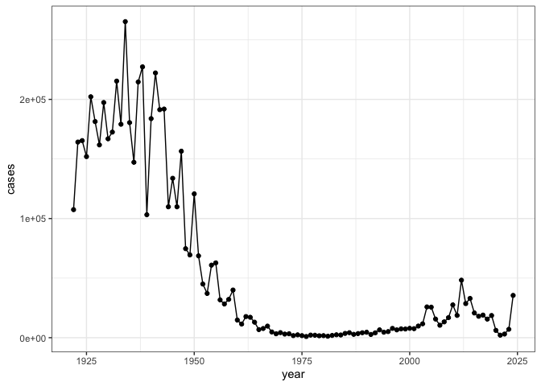
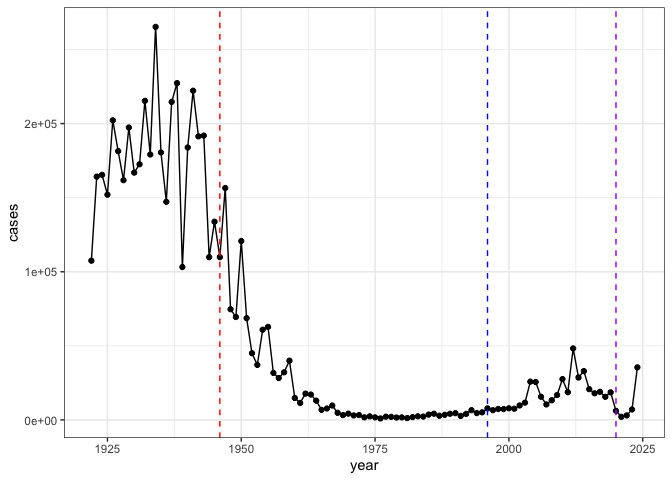
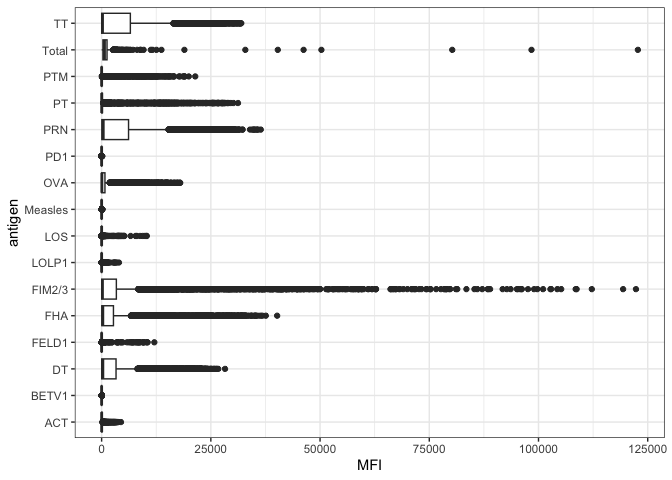
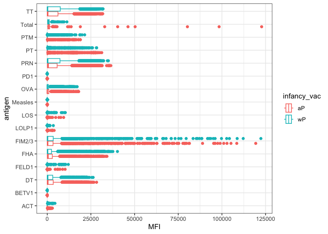
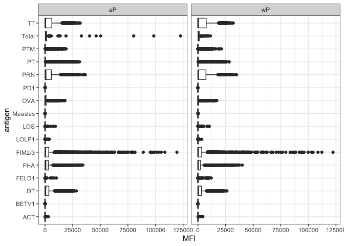
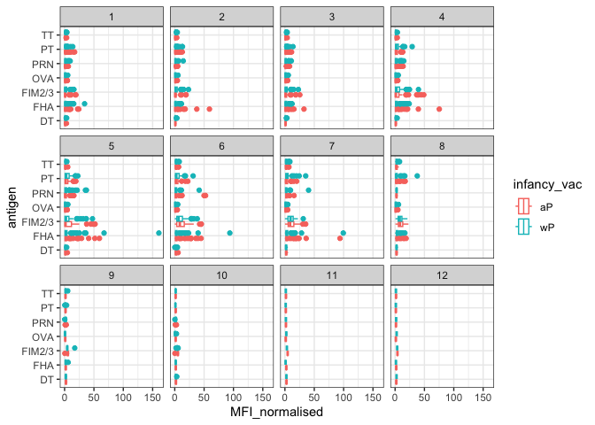
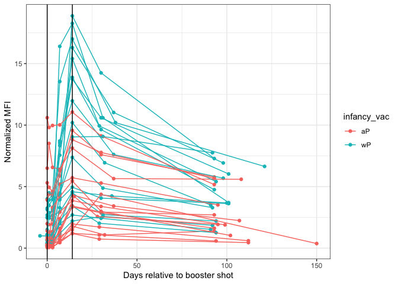

# Class 18 - Pertussis Mini Project
Gabriella Tanoto (A18024184)

## Background

Pertussis (aka Whooping Cough) is a common lung infection caused by the
bacteria *Bordetella pertussis*.

The CDC tracks cases of
[Pertussis](https://www.cdc.gov/pertussis/php/surveillance/pertussis-cases-by-year.html?CDC_AAref_Val=https://www.cdc.gov/pertussis/surv-reporting/cases-by-year.html)
in the US, becuase it is a very dangerous potential outbreak.

## Examine the cases of Pertussis by year

Entering the data from that website using the package `datapasta`. We
are going to scrape case numbers from the CDC website.

``` r
#install.packages("datapasta")
library(datapasta)
```

> Q1. Make a plot of the pertussis cases per year using ggplot.

``` r
library(ggplot2)
case.year_plot <- ggplot(cdc) +
                    aes(x = year, y= cases) +
                    geom_point() +
                    geom_line() +
                    theme_bw() 
case.year_plot
```



> Q2. Add some key timepoints in our history of interaction of
> Pertussis. These include the: wP roll-out first vaccine (1946) and the
> switch to aP (1996).

``` r
case.year_plot + 
  geom_vline(xintercept = 1946, color = "red", linetype= "dashed") +
  geom_vline(xintercept = 1996, color = "blue", linetype= "dashed") +
  geom_vline(xintercept = 2020, col = "purple", linetype= "dashed")
```



The red line here is when the first pertussis (whole-cell) vaccine is
distributed. The cases dropped intensely throughout the years as
everyone started getting the vaccination.

The blue line is when the aP starts getting distributed. The cases went
up again about 10 years after the aP vaccine switch. Mounting evidence
suggests that the newer **ap** vaccine is less effective in the long
term than the wP vaccine that was replaces. The vaccine efficacy wanes
faster than the wP version. The immune response built from the aP
vaccine is not as permanent as the old vaccine.

## The CMI-PB project

CMI-PB (Computational Models of Immunity - Pertussis boost) goal is to
investigate how immune system responds differently with aP vs wP
vaccinated individuals and to predict the resurgence. We want to see
what information is different between the two conditions, so we can
design a better treatment in the future.

The program studies the immune composition (antibody titers) of
different individuals vaccinated by aP & wP, after a Tdap booster shot
(this is as if we get infected by the Pertussis itself).

CMI-PB makes all their collected data available and they store it in a
database composed of different tables. Here, we will access a few of
these.

``` r
library(jsonlite)

subject <- read_json("https://www.cmi-pb.org/api/v5_1/subject", 
                     simplifyVector = T)
head(subject, 3)
```

      subject_id infancy_vac biological_sex              ethnicity  race
    1          1          wP         Female Not Hispanic or Latino White
    2          2          wP         Female Not Hispanic or Latino White
    3          3          wP         Female                Unknown White
      year_of_birth date_of_boost      dataset
    1    1986-01-01    2016-09-12 2020_dataset
    2    1968-01-01    2019-01-28 2020_dataset
    3    1983-01-01    2016-10-10 2020_dataset

> Q3. How many subjects (i.e., enrolled people) are there in this
> dataset?

``` r
nrow(subject)
```

    [1] 172

There are 172 people enrolled in this study.

> Q4. How many aP and wP infancy vaccinated subjects are in the dataset?

``` r
table(subject$infancy_vac)
```


    aP wP 
    87 85 

Typically, we want a 50/50 split, which these samples are pretty similar
the wP and aP.

> Q5. How many Male and Female subjects/patients are in the dataset?

``` r
table(subject$biological_sex)
```


    Female   Male 
       112     60 

> Q6. What is the breakdown of race and biological sex (e.g. number of
> Asian females, White males etc…)?

``` r
#make a cross table!
table(subject$race, subject$biological_sex) 
```

                                               
                                                Female Male
      American Indian/Alaska Native                  0    1
      Asian                                         32   12
      Black or African American                      2    3
      More Than One Race                            15    4
      Native Hawaiian or Other Pacific Islander      1    1
      Unknown or Not Reported                       14    7
      White                                         48   32

We want to make the data as representative of the US demographic as much
as we can, so we can compute a better prediction.

> Q7. Is this representative of the US demographic?

No, sadly.

### Reading in other data

Now, let’s read another database table from the CMI-PB. Read about the
specimen information and the antibody titers.

``` r
specimen <- read_json("http://cmi-pb.org/api/v5_1/specimen", simplifyVector = T)

ab_titer <- read_json("http://cmi-pb.org/api/v5_1/plasma_ab_titer", simplifyVector = T)
```

Take a peek of these data:

``` r
head(specimen, 3)
```

      specimen_id subject_id actual_day_relative_to_boost
    1           1          1                           -3
    2           2          1                            1
    3           3          1                            3
      planned_day_relative_to_boost specimen_type visit
    1                             0         Blood     1
    2                             1         Blood     2
    3                             3         Blood     3

``` r
head(ab_titer, 3)
```

      specimen_id isotype is_antigen_specific antigen        MFI MFI_normalised
    1           1     IgE               FALSE   Total 1110.21154       2.493425
    2           1     IgE               FALSE   Total 2708.91616       2.493425
    3           1     IgG                TRUE      PT   68.56614       3.736992
       unit lower_limit_of_detection
    1 UG/ML                 2.096133
    2 IU/ML                29.170000
    3 IU/ML                 0.530000

We want to join the `subject` and `specimen` tables to get more
information about everything. For this, we’ll use the `dplyr` package,
specifically the `*_join()` functions.

- `inner_join()`: only take complete data, omit the ones that are not
  the same between the two.
- `full_join()`: take all data, whether or not every row are contained
  by both dataset.

``` r
library(dplyr)
```


    Attaching package: 'dplyr'

    The following objects are masked from 'package:stats':

        filter, lag

    The following objects are masked from 'package:base':

        intersect, setdiff, setequal, union

``` r
meta <- inner_join(subject, specimen)
```

    Joining with `by = join_by(subject_id)`

``` r
head(meta, 3)
```

      subject_id infancy_vac biological_sex              ethnicity  race
    1          1          wP         Female Not Hispanic or Latino White
    2          1          wP         Female Not Hispanic or Latino White
    3          1          wP         Female Not Hispanic or Latino White
      year_of_birth date_of_boost      dataset specimen_id
    1    1986-01-01    2016-09-12 2020_dataset           1
    2    1986-01-01    2016-09-12 2020_dataset           2
    3    1986-01-01    2016-09-12 2020_dataset           3
      actual_day_relative_to_boost planned_day_relative_to_boost specimen_type
    1                           -3                             0         Blood
    2                            1                             1         Blood
    3                            3                             3         Blood
      visit
    1     1
    2     2
    3     3

Completing the metadata with the antibody information:

``` r
meta_ab <- inner_join(meta, ab_titer)
```

    Joining with `by = join_by(specimen_id)`

``` r
head(meta_ab, 6)
```

      subject_id infancy_vac biological_sex              ethnicity  race
    1          1          wP         Female Not Hispanic or Latino White
    2          1          wP         Female Not Hispanic or Latino White
    3          1          wP         Female Not Hispanic or Latino White
    4          1          wP         Female Not Hispanic or Latino White
    5          1          wP         Female Not Hispanic or Latino White
    6          1          wP         Female Not Hispanic or Latino White
      year_of_birth date_of_boost      dataset specimen_id
    1    1986-01-01    2016-09-12 2020_dataset           1
    2    1986-01-01    2016-09-12 2020_dataset           1
    3    1986-01-01    2016-09-12 2020_dataset           1
    4    1986-01-01    2016-09-12 2020_dataset           1
    5    1986-01-01    2016-09-12 2020_dataset           1
    6    1986-01-01    2016-09-12 2020_dataset           1
      actual_day_relative_to_boost planned_day_relative_to_boost specimen_type
    1                           -3                             0         Blood
    2                           -3                             0         Blood
    3                           -3                             0         Blood
    4                           -3                             0         Blood
    5                           -3                             0         Blood
    6                           -3                             0         Blood
      visit isotype is_antigen_specific antigen        MFI MFI_normalised  unit
    1     1     IgE               FALSE   Total 1110.21154       2.493425 UG/ML
    2     1     IgE               FALSE   Total 2708.91616       2.493425 IU/ML
    3     1     IgG                TRUE      PT   68.56614       3.736992 IU/ML
    4     1     IgG                TRUE     PRN  332.12718       2.602350 IU/ML
    5     1     IgG                TRUE     FHA 1887.12263      34.050956 IU/ML
    6     1     IgE                TRUE     ACT    0.10000       1.000000 IU/ML
      lower_limit_of_detection
    1                 2.096133
    2                29.170000
    3                 0.530000
    4                 6.205949
    5                 4.679535
    6                 2.816431

``` r
dim(meta_ab)
```

    [1] 61956    20

> Q8. How many antibody isotypes are there?

``` r
table(meta_ab$isotype)
```


      IgE   IgG  IgG1  IgG2  IgG3  IgG4 
     6698  7265 11993 12000 12000 12000 

There are 5 antibody isotypes. Different vaccines can induce different
subtypes of the IgG.

> Q9. How many different antigens are measured in this dataset?

``` r
table(meta_ab$antigen)
```


        ACT   BETV1      DT   FELD1     FHA  FIM2/3   LOLP1     LOS Measles     OVA 
       1970    1970    6318    1970    6712    6318    1970    1970    1970    6318 
        PD1     PRN      PT     PTM   Total      TT 
       1970    6712    6712    1970     788    6318 

15 differnet antigens. The measles is for control.

> Q10. Make boxplot of antigen levels accross the whole dataset.

``` r
ggplot(meta_ab) +
  aes(x = MFI, y= antigen) + 
  geom_boxplot() +
  theme_bw()
```

    Warning: Removed 1 row containing non-finite outside the scale range
    (`stat_boxplot()`).



> Are there obvious differences between the aP and wP values?

``` r
ggplot(meta_ab) +
  aes(x = MFI, y= antigen, color = infancy_vac) + 
  geom_boxplot() +
  theme_bw()
```

    Warning: Removed 1 row containing non-finite outside the scale range
    (`stat_boxplot()`).



Or we can facet by infancy_vac

``` r
ggplot(meta_ab) +
  aes(x = MFI, y= antigen) + 
  geom_boxplot() +
  facet_wrap(~infancy_vac) +
  theme_bw()
```

    Warning: Removed 1 row containing non-finite outside the scale range
    (`stat_boxplot()`).



## Focusing on just IgG levels

IgG is the most abundant antibody in the blood. With four subclasses, it
is crucial for long term immunity and responding to bacteria and viral
infections.

``` r
igG <- meta_ab |> 
            filter(isotype == "IgG")
head(igG, 4)
```

      subject_id infancy_vac biological_sex              ethnicity  race
    1          1          wP         Female Not Hispanic or Latino White
    2          1          wP         Female Not Hispanic or Latino White
    3          1          wP         Female Not Hispanic or Latino White
    4          1          wP         Female Not Hispanic or Latino White
      year_of_birth date_of_boost      dataset specimen_id
    1    1986-01-01    2016-09-12 2020_dataset           1
    2    1986-01-01    2016-09-12 2020_dataset           1
    3    1986-01-01    2016-09-12 2020_dataset           1
    4    1986-01-01    2016-09-12 2020_dataset           2
      actual_day_relative_to_boost planned_day_relative_to_boost specimen_type
    1                           -3                             0         Blood
    2                           -3                             0         Blood
    3                           -3                             0         Blood
    4                            1                             1         Blood
      visit isotype is_antigen_specific antigen        MFI MFI_normalised  unit
    1     1     IgG                TRUE      PT   68.56614       3.736992 IU/ML
    2     1     IgG                TRUE     PRN  332.12718       2.602350 IU/ML
    3     1     IgG                TRUE     FHA 1887.12263      34.050956 IU/ML
    4     2     IgG                TRUE      PT   41.38442       2.255534 IU/ML
      lower_limit_of_detection
    1                 0.530000
    2                 6.205949
    3                 4.679535
    4                 0.530000

Making the same boxplot of antigens, but specific to just these IgG data

``` r
ggplot(igG) +
  aes(MFI_normalised, antigen, color = infancy_vac) +
  geom_boxplot() +
  theme_bw() +
  facet_wrap(~visit)
```



Focusing in on just one Antigen – *PT* – in just one dataset, the *2021*
dataset! It’s Pertussis Toxin, the main toxin of the bacteria.

``` r
table(igG$dataset)
```


    2020_dataset 2021_dataset 2022_dataset 2023_dataset 
            1182         1617         1456         3010 

``` r
pt_igg <- meta_ab |> 
               filter(isotype =="IgG", 
                      antigen =="PT", 
                      dataset =="2021_dataset")
head(pt_igg, 4)
```

      subject_id infancy_vac biological_sex              ethnicity
    1         61          wP         Female Not Hispanic or Latino
    2         61          wP         Female Not Hispanic or Latino
    3         61          wP         Female Not Hispanic or Latino
    4         61          wP         Female Not Hispanic or Latino
                         race year_of_birth date_of_boost      dataset specimen_id
    1 Unknown or Not Reported    1987-01-01    2019-04-08 2021_dataset         468
    2 Unknown or Not Reported    1987-01-01    2019-04-08 2021_dataset         469
    3 Unknown or Not Reported    1987-01-01    2019-04-08 2021_dataset         470
    4 Unknown or Not Reported    1987-01-01    2019-04-08 2021_dataset         471
      actual_day_relative_to_boost planned_day_relative_to_boost specimen_type
    1                           -4                             0         Blood
    2                            1                             1         Blood
    3                            3                             3         Blood
    4                            7                             7         Blood
      visit isotype is_antigen_specific antigen    MFI MFI_normalised unit
    1     1     IgG               FALSE      PT 112.75      1.0000000  MFI
    2     2     IgG               FALSE      PT 111.25      0.9866962  MFI
    3     3     IgG               FALSE      PT 125.50      1.1130820  MFI
    4     4     IgG               FALSE      PT 224.25      1.9889135  MFI
      lower_limit_of_detection
    1                 5.197441
    2                 5.197441
    3                 5.197441
    4                 5.197441

``` r
dim(pt_igg)
```

    [1] 231  20

Make a plot of the MFI overtime. With the MFI (normalized) on Y axis and
the time as the x.

``` r
ggplot(pt_igg) +
  aes(x = actual_day_relative_to_boost , y = MFI_normalised, 
      col = infancy_vac,
      group = subject_id) +
  geom_point() +
  geom_line() + 
  geom_vline(xintercept = 0, col = "black") +
  geom_vline(xintercept = 14, col = "black") +
  ylab("Normalized MFI") + xlab("Days relative to booster shot")+
  theme_bw() 
```



See, around day 14, it seems interesting that the wP is showing higher
peaks than the aP individuals. This difference is a promising indicator,
since we can see that it differs between the two samples.
