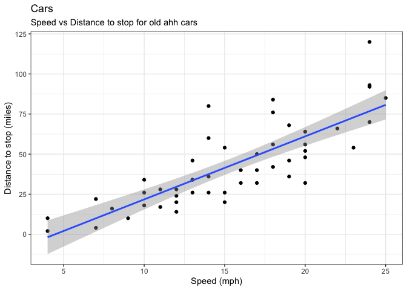
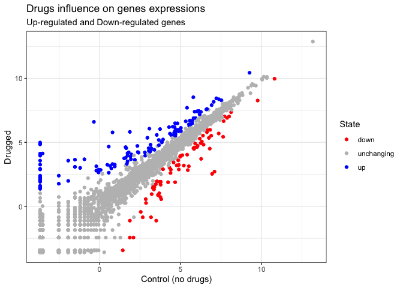
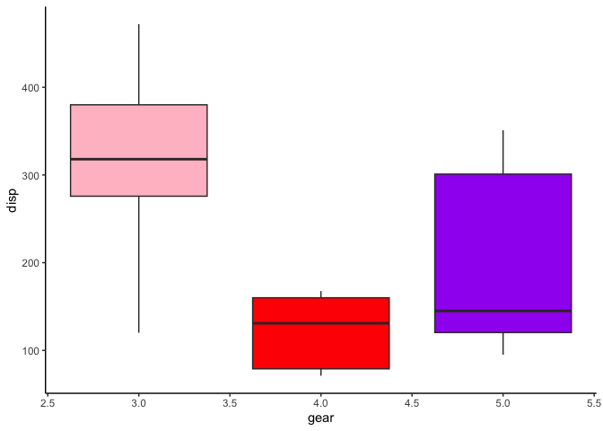
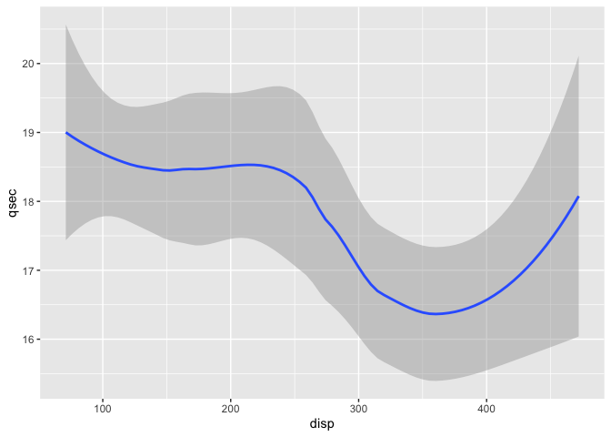
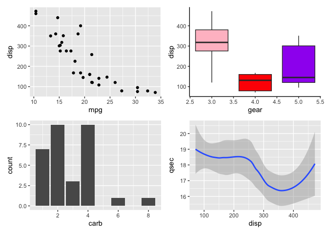
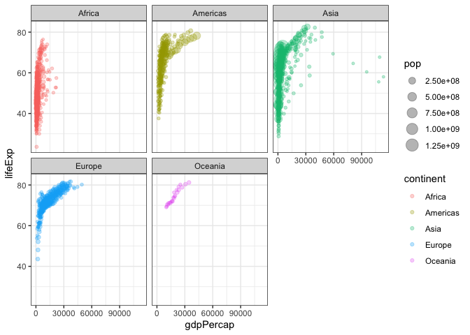

# Class 05 - DataVis with ggplot2
Gabriella Tanoto (A18024184)

- [Background](#background)
  - [baseR vs. ggplot2](#baser-vs-ggplot2)
  - [Gene Expression Plot: Using different **aes** and
    **geoms**](#gene-expression-plot-using-different-aes-and-geoms)
    - [mtcars dataset](#mtcars-dataset)
    - [Saving plots in a certain
      Sizing](#saving-plots-in-a-certain-sizing)
  - [Gap Minder - Sect 7 Labsheet](#gap-minder---sect-7-labsheet)

# Background

Graphics system examples: “base R” – included in the package. But, we
usually use the **ggplot2** Let’s compare “base” and **ggplot2**. Let’s
check our example data, `cars`:

``` r
head(cars, 6)
```

      speed dist
    1     4    2
    2     4   10
    3     7    4
    4     7   22
    5     8   16
    6     9   10

## baseR vs. ggplot2

In baseR, i can just call `plot()`

``` r
plot(cars)
```


Let’s call out **ggplot2**!

First, INSTALL PACKAGE, if not in your R yet. use this function, but in
R code! `install.packages("package__name")`

> KEY POINT: Only install packages in R console, don’t write it in
> quarto, cuz u r gonna have to install it every time they render T^T,
> not good. \[this thing shows like a notes\]

Before we use the package, you have to load it up using `library()`

``` r
library(ggplot2)
```

Every ggplot has *at least* 3 things:

- **Data** (in our case, `cars`)
- **Aes**thetics (how the data maps into the plot; i.e., x-axis and
  y-axis)
- **Geom**etries (determines how the plot will be drawn; i.e., boxplot,
  dotplots/points, lines, columns, etc.)

``` r
ggplot(data=cars, 
       aes(x= speed, y= dist)) +
  geom_point()
```


For simple plots, ggplot is a little more verbose than base R. But
defaults of ggplot is nicer! It’s easier to customize ggplots than it is
to customize baseR. We can add the layers to *aes* and *themes*. For
complicated plots, it’s much more efficient and structured

> Adding a line to show relationship between speed to stopping distance
> (ie, adding another ‘layer’)!

``` r
carplot <- ggplot(cars) + 
       aes(x= speed, y= dist) +
  geom_point() + geom_smooth(se=TRUE, method="lm")

#se = TRUE/FALSE is when u want the standard error area or not.
#"lm" ('linear models') is to linearize the fit. 

carplot
```

    `geom_smooth()` using formula = 'y ~ x'


> Adding Title and Subtitles!

``` r
carplot + labs(title="Cars", 
               subtitle="Speed vs Distance to stop for old ahh cars") +
  xlab("Speed (mph)")+ 
  ylab("Distance to stop (miles)")+
  theme_bw()
```

    `geom_smooth()` using formula = 'y ~ x'



## Gene Expression Plot: Using different **aes** and **geoms**

Open the gene expression example dataset

``` r
url <- "https://bioboot.github.io/bimm143_S20/class-material/up_down_expression.txt"
genes <- read.delim(url)
head(genes)
```

            Gene Condition1 Condition2      State
    1      A4GNT -3.6808610 -3.4401355 unchanging
    2       AAAS  4.5479580  4.3864126 unchanging
    3      AASDH  3.7190695  3.4787276 unchanging
    4       AATF  5.0784720  5.0151916 unchanging
    5       AATK  0.4711421  0.5598642 unchanging
    6 AB015752.4 -3.6808610 -3.5921390 unchanging

> Q: How many genes are in this dataset? - counting the rows:
> nrow(<dataset>) - counting the columns: ncol(<dataset>)

``` r
nrow(genes)
```

    [1] 5196

``` r
ncol(genes)
```

    [1] 4

> Q: What are the column names?

``` r
colnames(genes)
```

    [1] "Gene"       "Condition1" "Condition2" "State"     

> Q: How many “UP” and “DOWN” regulated genes are there?

``` r
sum(genes$State=="up")
```

    [1] 127

``` r
#CAN Only see the number of up's
```

OR:

``` r
table(genes$State)
```


          down unchanging         up 
            72       4997        127 

> Q: Making the 1st plot~

``` r
ggplot(genes) + 
  aes(x= Condition1, y= Condition2, color=State) +
  scale_color_manual(values=c("red", "grey", "blue")) +
  geom_point() +
  labs(title= "Drugs influence on genes expressions",
       subtitle= "Up-regulated and Down-regulated genes",
       x= "Control (no drugs)",
       y= "Drugged") +
  theme_bw()
```



### mtcars dataset

``` r
head(mtcars)
```

                       mpg cyl disp  hp drat    wt  qsec vs am gear carb
    Mazda RX4         21.0   6  160 110 3.90 2.620 16.46  0  1    4    4
    Mazda RX4 Wag     21.0   6  160 110 3.90 2.875 17.02  0  1    4    4
    Datsun 710        22.8   4  108  93 3.85 2.320 18.61  1  1    4    1
    Hornet 4 Drive    21.4   6  258 110 3.08 3.215 19.44  1  0    3    1
    Hornet Sportabout 18.7   8  360 175 3.15 3.440 17.02  0  0    3    2
    Valiant           18.1   6  225 105 2.76 3.460 20.22  1  0    3    1

> Q: Scatter plot of `mpg` and `disp`

``` r
pScat <- ggplot(mtcars)+
  aes(mpg, disp)+
  geom_point()
pScat
```


> Q: Boxplot of `gear` and `disp`

``` r
pBox <- ggplot(mtcars)+
  aes(x = gear, y = disp, group = gear)+
  geom_boxplot(fill= c("pink","red", "purple")) +
  theme_classic()
pBox
```



> Q: Barplot of `carb`

``` r
pBarplot <- ggplot(mtcars)+
  aes(carb)+
  geom_bar()
pBarplot
```


> Q: Smooth of `disp` and `qsec`

``` r
pSmooth <- ggplot(mtcars)+
  aes(disp, qsec)+
  geom_smooth()
pSmooth
```

    `geom_smooth()` using method = 'loess' and formula = 'y ~ x'



What if we wanna compile allllll these plots into one figure w multiple
panels? \> Use **Patchwork** package!

``` r
library(patchwork)
plotCompile <- (pScat / pBarplot |pBox / pSmooth)
plotCompile
```

    `geom_smooth()` using method = 'loess' and formula = 'y ~ x'



### Saving plots in a certain Sizing

``` r
ggsave(plotCompile, filename = "myplot.png", width = 5, height= 3)
```

    `geom_smooth()` using method = 'loess' and formula = 'y ~ x'

## Gap Minder - Sect 7 Labsheet

url for labsheet:
https://bioboot.github.io/bimm143_S25/class-material/lab05.html#going-further

``` r
url <- "https://raw.githubusercontent.com/jennybc/gapminder/master/inst/extdata/gapminder.tsv"
gapminder <- read.delim(url)


#look at just 10 lines of it!
head(gapminder, 10)
```

           country continent year lifeExp      pop gdpPercap
    1  Afghanistan      Asia 1952  28.801  8425333  779.4453
    2  Afghanistan      Asia 1957  30.332  9240934  820.8530
    3  Afghanistan      Asia 1962  31.997 10267083  853.1007
    4  Afghanistan      Asia 1967  34.020 11537966  836.1971
    5  Afghanistan      Asia 1972  36.088 13079460  739.9811
    6  Afghanistan      Asia 1977  38.438 14880372  786.1134
    7  Afghanistan      Asia 1982  39.854 12881816  978.0114
    8  Afghanistan      Asia 1987  40.822 13867957  852.3959
    9  Afghanistan      Asia 1992  41.674 16317921  649.3414
    10 Afghanistan      Asia 1997  41.763 22227415  635.3414

> Q: how many countries is in it?

``` r
table(gapminder$country)
```


                 Afghanistan                  Albania                  Algeria 
                          12                       12                       12 
                      Angola                Argentina                Australia 
                          12                       12                       12 
                     Austria                  Bahrain               Bangladesh 
                          12                       12                       12 
                     Belgium                    Benin                  Bolivia 
                          12                       12                       12 
      Bosnia and Herzegovina                 Botswana                   Brazil 
                          12                       12                       12 
                    Bulgaria             Burkina Faso                  Burundi 
                          12                       12                       12 
                    Cambodia                 Cameroon                   Canada 
                          12                       12                       12 
    Central African Republic                     Chad                    Chile 
                          12                       12                       12 
                       China                 Colombia                  Comoros 
                          12                       12                       12 
            Congo, Dem. Rep.              Congo, Rep.               Costa Rica 
                          12                       12                       12 
               Cote d'Ivoire                  Croatia                     Cuba 
                          12                       12                       12 
              Czech Republic                  Denmark                 Djibouti 
                          12                       12                       12 
          Dominican Republic                  Ecuador                    Egypt 
                          12                       12                       12 
                 El Salvador        Equatorial Guinea                  Eritrea 
                          12                       12                       12 
                    Ethiopia                  Finland                   France 
                          12                       12                       12 
                       Gabon                   Gambia                  Germany 
                          12                       12                       12 
                       Ghana                   Greece                Guatemala 
                          12                       12                       12 
                      Guinea            Guinea-Bissau                    Haiti 
                          12                       12                       12 
                    Honduras         Hong Kong, China                  Hungary 
                          12                       12                       12 
                     Iceland                    India                Indonesia 
                          12                       12                       12 
                        Iran                     Iraq                  Ireland 
                          12                       12                       12 
                      Israel                    Italy                  Jamaica 
                          12                       12                       12 
                       Japan                   Jordan                    Kenya 
                          12                       12                       12 
            Korea, Dem. Rep.              Korea, Rep.                   Kuwait 
                          12                       12                       12 
                     Lebanon                  Lesotho                  Liberia 
                          12                       12                       12 
                       Libya               Madagascar                   Malawi 
                          12                       12                       12 
                    Malaysia                     Mali               Mauritania 
                          12                       12                       12 
                   Mauritius                   Mexico                 Mongolia 
                          12                       12                       12 
                  Montenegro                  Morocco               Mozambique 
                          12                       12                       12 
                     Myanmar                  Namibia                    Nepal 
                          12                       12                       12 
                 Netherlands              New Zealand                Nicaragua 
                          12                       12                       12 
                       Niger                  Nigeria                   Norway 
                          12                       12                       12 
                        Oman                 Pakistan                   Panama 
                          12                       12                       12 
                    Paraguay                     Peru              Philippines 
                          12                       12                       12 
                      Poland                 Portugal              Puerto Rico 
                          12                       12                       12 
                     Reunion                  Romania                   Rwanda 
                          12                       12                       12 
       Sao Tome and Principe             Saudi Arabia                  Senegal 
                          12                       12                       12 
                      Serbia             Sierra Leone                Singapore 
                          12                       12                       12 
             Slovak Republic                 Slovenia                  Somalia 
                          12                       12                       12 
                South Africa                    Spain                Sri Lanka 
                          12                       12                       12 
                       Sudan                Swaziland                   Sweden 
                          12                       12                       12 
                 Switzerland                    Syria                   Taiwan 
                          12                       12                       12 
                    Tanzania                 Thailand                     Togo 
                          12                       12                       12 
         Trinidad and Tobago                  Tunisia                   Turkey 
                          12                       12                       12 
                      Uganda           United Kingdom            United States 
                          12                       12                       12 
                     Uruguay                Venezuela                  Vietnam 
                          12                       12                       12 
          West Bank and Gaza              Yemen, Rep.                   Zambia 
                          12                       12                       12 
                    Zimbabwe 
                          12 

``` r
length(table(gapminder$country))
```

    [1] 142

> Q: Plot of GDP v Life expectancy - When coloring something according
> to a data, we don’t wanna make it as a “string”. NO QUOTATION
> MARKKKKKK - Facet_wrap will separate all the data according to some
> kind of group!

``` r
ggplot(gapminder) +
  aes(gdpPercap, lifeExp, color=continent, size=pop) + 
  geom_point(alpha=0.3) +
  facet_wrap(~continent) +
  theme_bw()
```


