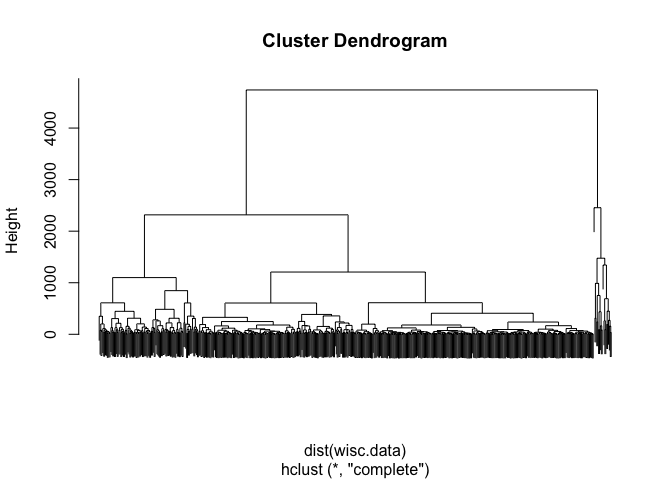
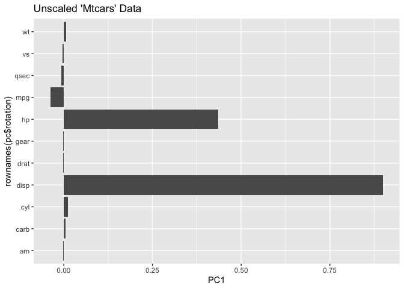
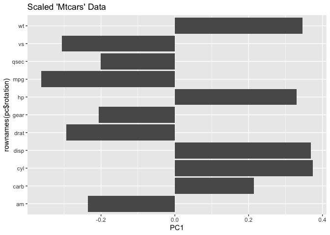
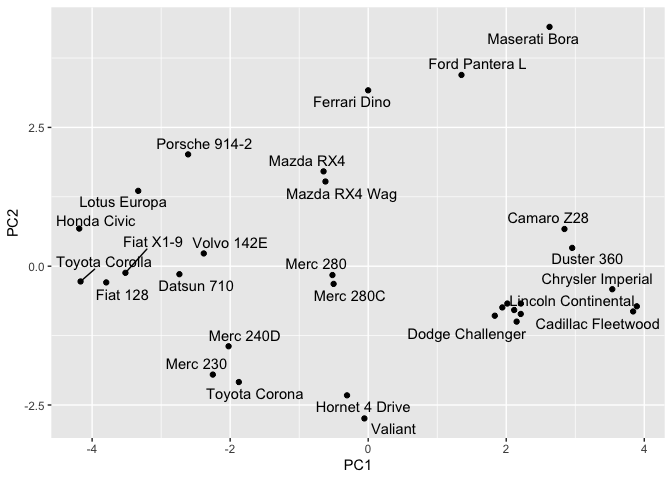
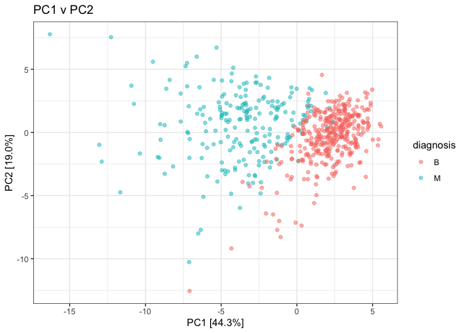
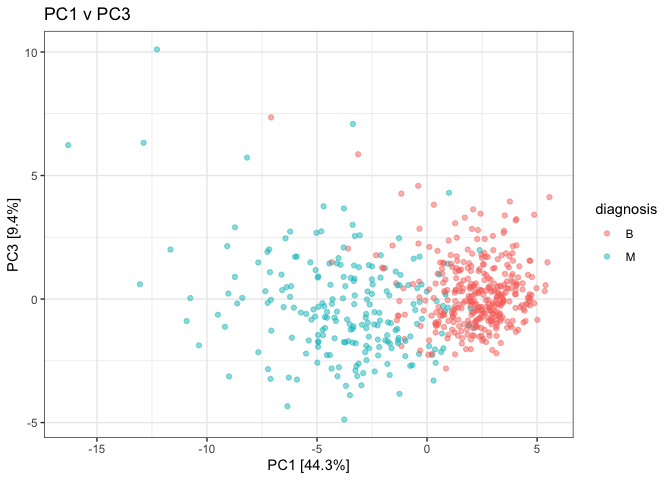
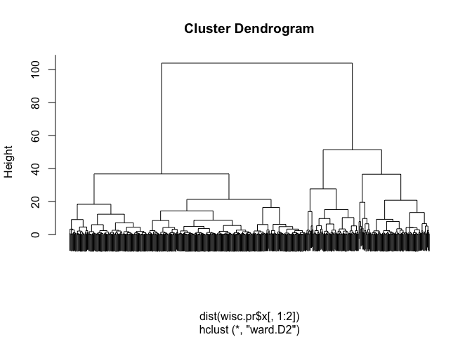
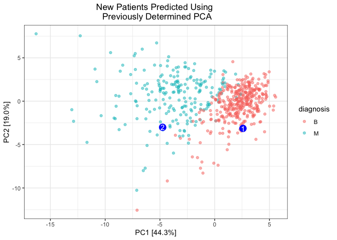

# Class 08 - Mini Project
Gabriella Tanoto (A18024184)

- [Background](#background)
  - [Data Import](#data-import)
- [Clustering](#clustering)
  - [PCA](#pca)
    - [The importance of Scaling](#the-importance-of-scaling)
    - [Going back to the Wisc Cancer
      data:](#going-back-to-the-wisc-cancer-data)
    - [Clustering on PCA results](#clustering-on-pca-results)
  - [Prediction](#prediction)

# Background

This mini-project explores unsupervised learning techniques applied to
the Wisconsin Breast Cancer Diagnostic Data Set, which contains
measurements of human breast mass cell nuclei. The project guides the
user through exploratory data analysis, performing and interpreting
Principal Component Analysis (PCA) to reduce the dimensionality of the
data while retaining variance, and applying hierarchical clustering with
different linkage methods. It also includes an optional section on
K-means clustering for comparison. The ultimate goal is to combine PCA
and clustering to better separate benign and malignant cell samples,
evaluating the results using metrics like sensitivity and specificity,
and finally demonstrating how to predict the classification of new
samples using the developed PCA model.

## Data Import

Our data comes from the Wisconsin Medical Center. Let’s load the saved
datasets.

``` r
wisc.df <- read.csv("WisconsinCancer.csv", row.names=1) #so the ID is just a row name; not a data we're working with.
head(wisc.df, 5)
```

             diagnosis radius_mean texture_mean perimeter_mean area_mean
    842302           M       17.99        10.38         122.80    1001.0
    842517           M       20.57        17.77         132.90    1326.0
    84300903         M       19.69        21.25         130.00    1203.0
    84348301         M       11.42        20.38          77.58     386.1
    84358402         M       20.29        14.34         135.10    1297.0
             smoothness_mean compactness_mean concavity_mean concave.points_mean
    842302           0.11840          0.27760         0.3001             0.14710
    842517           0.08474          0.07864         0.0869             0.07017
    84300903         0.10960          0.15990         0.1974             0.12790
    84348301         0.14250          0.28390         0.2414             0.10520
    84358402         0.10030          0.13280         0.1980             0.10430
             symmetry_mean fractal_dimension_mean radius_se texture_se perimeter_se
    842302          0.2419                0.07871    1.0950     0.9053        8.589
    842517          0.1812                0.05667    0.5435     0.7339        3.398
    84300903        0.2069                0.05999    0.7456     0.7869        4.585
    84348301        0.2597                0.09744    0.4956     1.1560        3.445
    84358402        0.1809                0.05883    0.7572     0.7813        5.438
             area_se smoothness_se compactness_se concavity_se concave.points_se
    842302    153.40      0.006399        0.04904      0.05373           0.01587
    842517     74.08      0.005225        0.01308      0.01860           0.01340
    84300903   94.03      0.006150        0.04006      0.03832           0.02058
    84348301   27.23      0.009110        0.07458      0.05661           0.01867
    84358402   94.44      0.011490        0.02461      0.05688           0.01885
             symmetry_se fractal_dimension_se radius_worst texture_worst
    842302       0.03003             0.006193        25.38         17.33
    842517       0.01389             0.003532        24.99         23.41
    84300903     0.02250             0.004571        23.57         25.53
    84348301     0.05963             0.009208        14.91         26.50
    84358402     0.01756             0.005115        22.54         16.67
             perimeter_worst area_worst smoothness_worst compactness_worst
    842302            184.60     2019.0           0.1622            0.6656
    842517            158.80     1956.0           0.1238            0.1866
    84300903          152.50     1709.0           0.1444            0.4245
    84348301           98.87      567.7           0.2098            0.8663
    84358402          152.20     1575.0           0.1374            0.2050
             concavity_worst concave.points_worst symmetry_worst
    842302            0.7119               0.2654         0.4601
    842517            0.2416               0.1860         0.2750
    84300903          0.4504               0.2430         0.3613
    84348301          0.6869               0.2575         0.6638
    84358402          0.4000               0.1625         0.2364
             fractal_dimension_worst
    842302                   0.11890
    842517                   0.08902
    84300903                 0.08758
    84348301                 0.17300
    84358402                 0.07678

> Q1. How many observations is in the dataset?

We have *569 patients* in this dataset!

``` r
nrow(wisc.df)
```

    [1] 569

> Q2. How many of the observations have a malignant diagnosis?

There are *212 malignant* diagnosis.

``` r
sum(wisc.df$diagnosis=="M")
```

    [1] 212

OR:

``` r
table(wisc.df$diagnosis)
```


      B   M 
    357 212 

> Q3. How many variables/features in the data are suffixed with
> “\_mean”?

There are *10* column names contains “\_mean” in it!

``` r
grep("_mean", colnames(wisc.df)) #will tell us which column names have the "_mean"
```

     [1]  2  3  4  5  6  7  8  9 10 11

``` r
length(grep("_mean", colnames(wisc.df))) #tell us HOW MANY vectors there are that's in my `grep()`
```

    [1] 10

There is a diagnosis column, that is the clinician’s consensus that I
wanna exclude from my further analysis. We can come back later and
compare our results to this diagnosis!

``` r
diagnosis <- as.factor(wisc.df$diagnosis)
head(diagnosis) #with the as.factor function, we can see there's level to it. 
```

    [1] M M M M M M
    Levels: B M

Now we can remove it from the `wisc.df`, and save it as a `wisc.data`

``` r
wisc.data <- wisc.df[,-1]
dim(wisc.data) #now we see we removed the first column -- NO MORE Clinician's DIAGNOSIS!
```

    [1] 569  30

# Clustering

We can choose either `kmeans`, `hclust`, or the `pca`.

Let’s try the h-clust (Hierarchical clustering)!

``` r
hc <- hclust(dist(wisc.data))
plot(hc, labels = F)
```



We can extract clusters from the weird dandogram using the `cutree()`
function!

``` r
groups <- cutree(hc, k= 2) #cut the tree into 2 major branches!
table(groups)
```

    groups
      1   2 
    549  20 

Maybe, let’s compare it with the diagnosis…

``` r
table(diagnosis)
```

    diagnosis
      B   M 
    357 212 

To compare the two tables in one, we can do a cross-table that compares
our cluster `groups` vectors with our `diagnosis` data:

``` r
table(diagnosis, groups)
```

             groups
    diagnosis   1   2
            B 357   0
            M 192  20

–\> all the weird (most extreme ones the hclust can pick up) is
Malignant. But this is bad, cuz it can only pick up the VERY weird ones.
We need a better method.

## PCA

### The importance of Scaling

The main function for PCA in base R `prcomp`. It’s got a default input
parameter of `scale = FALSE`

``` r
#use the mtcar dataset
head(mtcars,4)
```

                    mpg cyl disp  hp drat    wt  qsec vs am gear carb
    Mazda RX4      21.0   6  160 110 3.90 2.620 16.46  0  1    4    4
    Mazda RX4 Wag  21.0   6  160 110 3.90 2.875 17.02  0  1    4    4
    Datsun 710     22.8   4  108  93 3.85 2.320 18.61  1  1    4    1
    Hornet 4 Drive 21.4   6  258 110 3.08 3.215 19.44  1  0    3    1

We can do PCA of the data as is, but it could be misleading…

``` r
pc <- prcomp(mtcars)
biplot(pc)
```


Without scaling: the ones that are in the scales of 100-300 (such as the
`disp`) are spread out way more than the ones like the `vs` or `am`
columns which shows Yes/No values. So, just because the data’s got a
huge spread, doesn’t mean it’s more important than the others.

Now let’s pay attention to the mean and sd of each columns.

``` r
colMeans(mtcars)
```

           mpg        cyl       disp         hp       drat         wt       qsec 
     20.090625   6.187500 230.721875 146.687500   3.596563   3.217250  17.848750 
            vs         am       gear       carb 
      0.437500   0.406250   3.687500   2.812500 

``` r
apply(mtcars, 2, sd) #2 is code for columns!
```

            mpg         cyl        disp          hp        drat          wt 
      6.0269481   1.7859216 123.9386938  68.5628685   0.5346787   0.9784574 
           qsec          vs          am        gear        carb 
      1.7869432   0.5040161   0.4989909   0.7378041   1.6152000 

We can see here that the data is more spread for ones with scales like
100s, because it’s got different UNITS. Makes no sense to PCA out of
this!

To fix, we can **Scale** the data before PCA, to get a much better
representation and analysis of all the columns. Use the function
`scale()` to our dataset.

``` r
mtscale <- scale(mtcars)
```

Check the means & sd:

``` r
colMeans(mtscale)
```

              mpg           cyl          disp            hp          drat 
     7.112366e-17 -1.474515e-17 -9.085614e-17  1.040834e-17 -2.918672e-16 
               wt          qsec            vs            am          gear 
     4.682398e-17  5.299580e-16  6.938894e-18  4.510281e-17 -3.469447e-18 
             carb 
     3.165870e-17 

``` r
apply(mtscale, 2, sd)
```

     mpg  cyl disp   hp drat   wt qsec   vs   am gear carb 
       1    1    1    1    1    1    1    1    1    1    1 

Do prcomp on the scaled data:

``` r
pc.scale <-prcomp(mtscale)
biplot(pc.scale)
```


This 3-step scaling technique can be made as a shortcut into the
`prcomp` function by setting `scale=TRUE`:

``` r
pc.scale2 <- prcomp(mtcars, scale.=T)
biplot(pc.scale2)
```


2 figures to represent PCA. Let’s do a Loadings Plot od the Unscaled PCA
results:

``` r
library(ggplot2)

ggplot(pc$rotation) +
  aes(PC1, rownames(pc$rotation))+
  geom_col() +
  ggtitle("Unscaled 'Mtcars' Data")
```



Plot of the Scaled PCA:

``` r
ggplot(pc.scale$rotation) +
  aes(PC1, rownames(pc$rotation))+
  geom_col()+
  ggtitle("Scaled 'Mtcars' Data")
```



Much better than the unscaled, as we can see that it’s not just heavy on
the bigger-unit features.

PC plot of Scaled PCA:

``` r
library(ggrepel)

ggplot(pc.scale$x) +
  aes(PC1, PC2, label = rownames(pc.scale$x))+
  geom_point() +
  geom_text_repel()
```

    Warning: ggrepel: 6 unlabeled data points (too many overlaps). Consider
    increasing max.overlaps



> **Key Point**:  
> In general, we will set `scale = TRUE` when we do PCA. This isn’t the
> default but it probably should be…

### Going back to the Wisc Cancer data:

Now, we can check the SD and the Mean of the `wisc.data` to see if we
need to scale it.

``` r
colMeans(wisc.data)
```

                radius_mean            texture_mean          perimeter_mean 
               1.412729e+01            1.928965e+01            9.196903e+01 
                  area_mean         smoothness_mean        compactness_mean 
               6.548891e+02            9.636028e-02            1.043410e-01 
             concavity_mean     concave.points_mean           symmetry_mean 
               8.879932e-02            4.891915e-02            1.811619e-01 
     fractal_dimension_mean               radius_se              texture_se 
               6.279761e-02            4.051721e-01            1.216853e+00 
               perimeter_se                 area_se           smoothness_se 
               2.866059e+00            4.033708e+01            7.040979e-03 
             compactness_se            concavity_se       concave.points_se 
               2.547814e-02            3.189372e-02            1.179614e-02 
                symmetry_se    fractal_dimension_se            radius_worst 
               2.054230e-02            3.794904e-03            1.626919e+01 
              texture_worst         perimeter_worst              area_worst 
               2.567722e+01            1.072612e+02            8.805831e+02 
           smoothness_worst       compactness_worst         concavity_worst 
               1.323686e-01            2.542650e-01            2.721885e-01 
       concave.points_worst          symmetry_worst fractal_dimension_worst 
               1.146062e-01            2.900756e-01            8.394582e-02 

``` r
apply(wisc.data, 2, sd)
```

                radius_mean            texture_mean          perimeter_mean 
               3.524049e+00            4.301036e+00            2.429898e+01 
                  area_mean         smoothness_mean        compactness_mean 
               3.519141e+02            1.406413e-02            5.281276e-02 
             concavity_mean     concave.points_mean           symmetry_mean 
               7.971981e-02            3.880284e-02            2.741428e-02 
     fractal_dimension_mean               radius_se              texture_se 
               7.060363e-03            2.773127e-01            5.516484e-01 
               perimeter_se                 area_se           smoothness_se 
               2.021855e+00            4.549101e+01            3.002518e-03 
             compactness_se            concavity_se       concave.points_se 
               1.790818e-02            3.018606e-02            6.170285e-03 
                symmetry_se    fractal_dimension_se            radius_worst 
               8.266372e-03            2.646071e-03            4.833242e+00 
              texture_worst         perimeter_worst              area_worst 
               6.146258e+00            3.360254e+01            5.693570e+02 
           smoothness_worst       compactness_worst         concavity_worst 
               2.283243e-02            1.573365e-01            2.086243e-01 
       concave.points_worst          symmetry_worst fractal_dimension_worst 
               6.573234e-02            6.186747e-02            1.806127e-02 

We do indeed have to scale it, before making the `prcomp`

``` r
wisc.pr <- prcomp(wisc.data, scale = TRUE)
```

To see how well PCA captures the variance, we can use the `summary`
function:

``` r
summary(wisc.pr)
```

    Importance of components:
                              PC1    PC2     PC3     PC4     PC5     PC6     PC7
    Standard deviation     3.6444 2.3857 1.67867 1.40735 1.28403 1.09880 0.82172
    Proportion of Variance 0.4427 0.1897 0.09393 0.06602 0.05496 0.04025 0.02251
    Cumulative Proportion  0.4427 0.6324 0.72636 0.79239 0.84734 0.88759 0.91010
                               PC8    PC9    PC10   PC11    PC12    PC13    PC14
    Standard deviation     0.69037 0.6457 0.59219 0.5421 0.51104 0.49128 0.39624
    Proportion of Variance 0.01589 0.0139 0.01169 0.0098 0.00871 0.00805 0.00523
    Cumulative Proportion  0.92598 0.9399 0.95157 0.9614 0.97007 0.97812 0.98335
                              PC15    PC16    PC17    PC18    PC19    PC20   PC21
    Standard deviation     0.30681 0.28260 0.24372 0.22939 0.22244 0.17652 0.1731
    Proportion of Variance 0.00314 0.00266 0.00198 0.00175 0.00165 0.00104 0.0010
    Cumulative Proportion  0.98649 0.98915 0.99113 0.99288 0.99453 0.99557 0.9966
                              PC22    PC23   PC24    PC25    PC26    PC27    PC28
    Standard deviation     0.16565 0.15602 0.1344 0.12442 0.09043 0.08307 0.03987
    Proportion of Variance 0.00091 0.00081 0.0006 0.00052 0.00027 0.00023 0.00005
    Cumulative Proportion  0.99749 0.99830 0.9989 0.99942 0.99969 0.99992 0.99997
                              PC29    PC30
    Standard deviation     0.02736 0.01153
    Proportion of Variance 0.00002 0.00000
    Cumulative Proportion  1.00000 1.00000

Now, let’s make the main PC plot (PC1 v PC2)

``` r
ggplot(wisc.pr$x) +
  aes(PC1, PC2, col=diagnosis) +
  geom_point(alpha=0.5) +
  xlab("PC1 [44.3%]") + ylab("PC2 [19.0%]") +
  ggtitle("PC1 v PC2") +
  theme_bw()
```



This is good, because we can see that it’s different enough to determine
whether the cell is gonna be ‘benign’ or ‘malignant’. Therefore, we can
potentially predict which factor (out of the 30), is the one that’s most
prominent.  
But how, exactly, does PCA do to compress the 30 different factors into
1 dot??

> Q4. From your results, what proportion of the original variance is
> captured by the first principal components (PC1)?

We have *44.3% of the variance* captured by PC1.

> Q5. How many principal components (PCs) are required to describe at
> least 70% of the original variance in the data?

From this info, 70% of the variance is captured in *3 PCs*.

> Q6. How many principal components (PCs) are required to describe at
> least 90% of the original variance in the data?

90% of the variance is captured in *7 PCs*.

> Q7. What stands out to you about this plot? Is it easy or difficult to
> understand? Why?

The PC1 v PC2 plot actually showed that there is a difference between
the benign and the malignant cells, as we can see when we color it by
the diagnosis.  
It is quite easy to undersatnd once I know what PC’s are and what it
means, because now I know that the cells vary more along the PC1 (x)
axis, and as they are different, they are also different in the
diagnosis: more benign cells are in the Right side, and malignant on the
Left of the PC1.

> Q8. Generate a similar plot for principal components 1 and 3. What do
> you notice about these plots?

``` r
ggplot(wisc.pr$x) +
  aes(PC1, PC3, col=diagnosis) +
  geom_point(alpha=0.5) +
  xlab("PC1 [44.3%]") + ylab("PC3 [9.4%]") +
  ggtitle("PC1 v PC3") +
  theme_bw()
```



We can see that the separation still exists, and it’s still pretty good.
However, the separation between the benign and malignant cells are not
as good as plot of ‘PC1 and PC2’.

> Q9. For the first principal component, what is the component of the
> loading vector (i.e. `wisc.pr$rotation[,1]`) for the feature
> concave.points_mean?

``` r
wisc.pr$rotation[, 1]
```

                radius_mean            texture_mean          perimeter_mean 
                -0.21890244             -0.10372458             -0.22753729 
                  area_mean         smoothness_mean        compactness_mean 
                -0.22099499             -0.14258969             -0.23928535 
             concavity_mean     concave.points_mean           symmetry_mean 
                -0.25840048             -0.26085376             -0.13816696 
     fractal_dimension_mean               radius_se              texture_se 
                -0.06436335             -0.20597878             -0.01742803 
               perimeter_se                 area_se           smoothness_se 
                -0.21132592             -0.20286964             -0.01453145 
             compactness_se            concavity_se       concave.points_se 
                -0.17039345             -0.15358979             -0.18341740 
                symmetry_se    fractal_dimension_se            radius_worst 
                -0.04249842             -0.10256832             -0.22799663 
              texture_worst         perimeter_worst              area_worst 
                -0.10446933             -0.23663968             -0.22487053 
           smoothness_worst       compactness_worst         concavity_worst 
                -0.12795256             -0.21009588             -0.22876753 
       concave.points_worst          symmetry_worst fractal_dimension_worst 
                -0.25088597             -0.12290456             -0.13178394 

It is *-0.26085376*. There’s **NO ONE** factor that makes the cell
benign or not, each factor kind of contributes to it.

> Q10. What is the minimum number of principal components required to
> explain 80% of the variance of the data?

5 PCs are required to capture 80% of the variance in the data.

### Clustering on PCA results

Now, let’s try clustering these cells, based on PC1 and 2, instead of
just as is.

``` r
wisc.pr.hclust <- hclust(dist(wisc.pr$x[, 1:2]), method= "ward.D2")
plot(wisc.pr.hclust, labels = FALSE)
```



We can make a `cutree`

``` r
pcgroups <- cutree(wisc.pr.hclust, k= 2)
table(pcgroups)
```

    pcgroups
      1   2 
    195 374 

Now, crosscheck with the diagnosis table!

``` r
table(diagnosis, pcgroups)
```

             pcgroups
    diagnosis   1   2
            B  18 339
            M 177  35

^ Most individuals that are benign will fall into Group 2, whereas the
ones in Group 1, the vast majority is Malignant. There are still some
false positive/ false negatives. We can then estimate the sensitivity.

It’s a much better predictor than the last one where we have 18 and 0.

> (Q10 gradescope) Using the plot() and abline() functions, what is the
> height at which the clustering model has 4 clusters?  
> **WE DIDN’T COVER THIS IN CLASS**

> (Q12 gradescope) Which method gives your favorite result for the same
> data.dist dataset?  
> **WE DIDN’T COVER THIS IN CLASS**

> (Q13 gradescope) How well does the newly created model with four
> clusters separate out the two diagnoses?  
> **WE DIDN’T COVER THIS IN CLASS**

> Q15 in class. Which one, using PC 1 and 2 only or using PC1:7 that
> covers 90% of the variance is better at separating benign vs malignant
> cells?

``` r
#using PC 1 through 7, we can capture 90% of the variance in the data. 
wisc.pr.hclust90 <- hclust(dist(wisc.pr$x[, 1:7]), method= "ward.D2")
pcgroups90 <- cutree(wisc.pr.hclust90, k= 2)
table(diagnosis, pcgroups90)
```

             pcgroups90
    diagnosis   1   2
            B  28 329
            M 188  24

False negative: When we predict the cell to be benign (B) but it’s
actually cancerous. False positive: When we predict the cell to be
cancerous (M) but it’s benign.

Using the PC method, we can group each cells to either cluster 1 (where
they are predicted to be Malignant/cancerous), or cluster 2. When we use
this clustering to predict, people who is in group 1 is gonna be
considered (+) for Malignant. When looking at group 1, there’s **MORE
false positive** (12.96%) using the 91% clustering, compared to the
previous one that covers 63% of the variance (9.23% false positives).

If you are in group 2, you’re more likely to be benign. There is
**LESS** chance that you get a *false negative* (cancer but predicted to
be OK) compared to when the PC just covers 63% of the variance.

I think the better one would be the 90%, because we can catch more
potentially malignant patients; although we might accidentally cause
panic (false positives).

> Q16 (Q14 gradescope). How well do the k-means and hierarchical
> clustering models you created in previous sections (i.e. before PCA)
> do in terms of separating the diagnoses? Again, use the table()
> function to compare the output of each model (wisc.km\$cluster and
> wisc.hclust.clusters) with the vector containing the actual diagnoses.

We didn’t do the K-means, but we did group the using the hierarchical
cluster (before doing any PCA analysis). Below is the code for the
comparison between h-clustering groups:

``` r
table(groups, diagnosis)
```

          diagnosis
    groups   B   M
         1 357 192
         2   0  20

As we can see, it is of very low quality, we cannot use the grouping
result of h-clustering to predict if one were to be a malignant or
benign tumor cell.

If we just force ourselves to see the pattern, we’ll see that the Group
2 tend to be malignant, but 35% of group 1 is also malignant. There
would be way too many false negatives with this data.

However, once we used PCA to take into account the whole thing, we can
see that the data actually gets clustered pretty well.

## Prediction

We can use the PCA data to analyse new “unseen” data. In this case, we
use data from U of Michigan.

``` r
new <- read.csv("new_samples.csv")
npc <- predict(wisc.pr, newdata=new)
npc
```

               PC1       PC2        PC3        PC4       PC5        PC6        PC7
    [1,]  2.576616 -3.135913  1.3990492 -0.7631950  2.781648 -0.8150185 -0.3959098
    [2,] -4.754928 -3.009033 -0.1660946 -0.6052952 -1.140698 -1.2189945  0.8193031
                PC8       PC9       PC10      PC11      PC12      PC13     PC14
    [1,] -0.2307350 0.1029569 -0.9272861 0.3411457  0.375921 0.1610764 1.187882
    [2,] -0.3307423 0.5281896 -0.4855301 0.7173233 -1.185917 0.5893856 0.303029
              PC15       PC16        PC17        PC18        PC19       PC20
    [1,] 0.3216974 -0.1743616 -0.07875393 -0.11207028 -0.08802955 -0.2495216
    [2,] 0.1299153  0.1448061 -0.40509706  0.06565549  0.25591230 -0.4289500
               PC21       PC22       PC23       PC24        PC25         PC26
    [1,]  0.1228233 0.09358453 0.08347651  0.1223396  0.02124121  0.078884581
    [2,] -0.1224776 0.01732146 0.06316631 -0.2338618 -0.20755948 -0.009833238
                 PC27        PC28         PC29         PC30
    [1,]  0.220199544 -0.02946023 -0.015620933  0.005269029
    [2,] -0.001134152  0.09638361  0.002795349 -0.019015820

> Q18. Which of these new patients should we prioritize for follow up
> based on your results?

``` r
library(ggeasy)

plotpc <- ggplot(wisc.pr$x) +
  aes(PC1, PC2, col=diagnosis) +
  geom_point(alpha=0.5) +
  xlab("PC1 [44.3%]") + ylab("PC2 [19.0%]") +
  ggtitle("New Patients Predicted Using \n Previously Determined PCA")+
  theme_bw() + ggeasy::easy_center_title()

#Add the new patients we wanna predict as blue dots; and adding the labels.
plotpc + annotate("point", npc[,1], npc[,2], color="blue", size = 4.5) + 
  annotate("text", npc[,1], npc[,2], color="white", label= c("1", "2")) 
```



From this newly generated plot, we can see that patient \#1 is likely to
be benign, and patient \#2 is likely to have a malignant cell.
Therefore, we should prioritize the patient 2, as they are more likely
to suffer from cancer.
