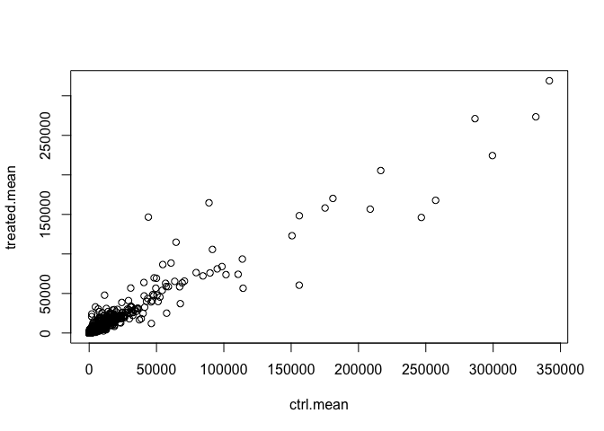
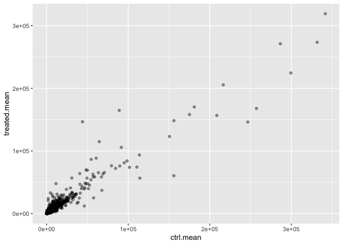
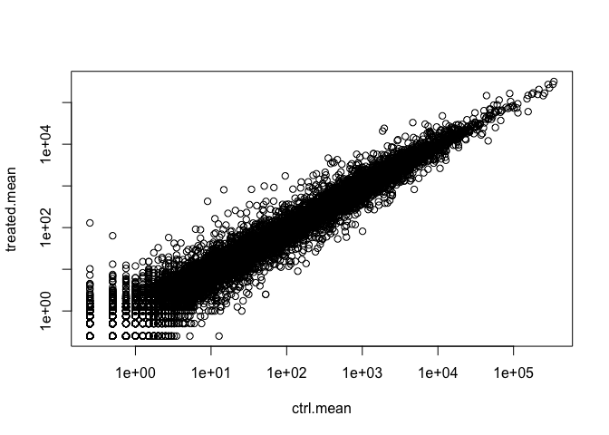
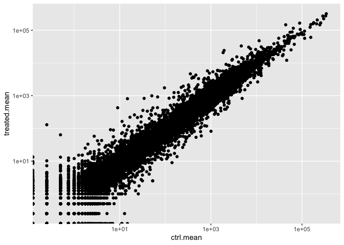
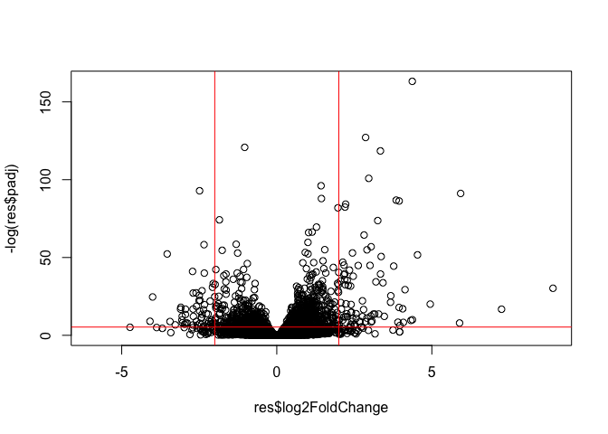
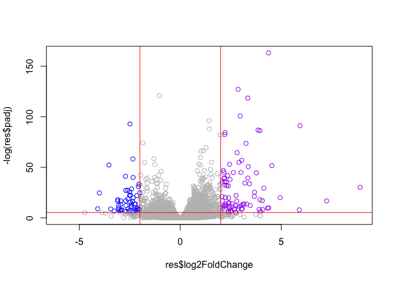
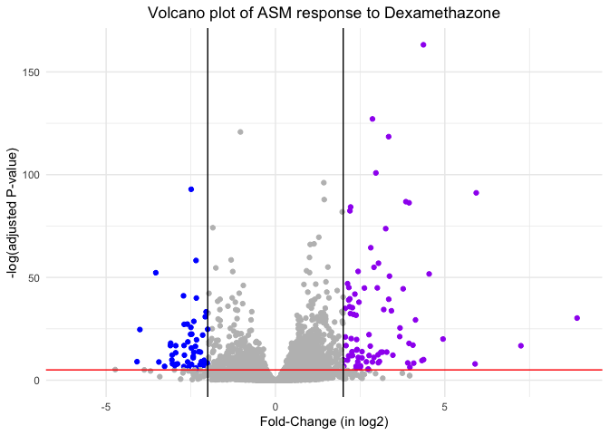

# Class 13 - Transcriptomics and the analysis of RNA-Seq data
Gabriella Tanoto (A18024184)

- [Background](#background)
- [Installing packages](#installing-packages)
- [Importing the dataset](#importing-the-dataset)
- [Toy differential gene expression](#toy-differential-gene-expression)
- [DESeq2](#deseq2)
  - [Result figure - Volcano Plots](#result-figure---volcano-plots)
- [Adding gene annotation!](#adding-gene-annotation)
- [Pathway analysis](#pathway-analysis)

# Background

Today, we’ll analyze some RNA seq data on the effects of common steroid
drug on ASM (airway smooth muscle) cell lines.

# Installing packages

Install the `DESeq2` package thru `BiocManager`. After installing, we
can load the package `DESeq2`!

# Importing the dataset

There are two inputs we need for this *DESeq2* analysis:

- `countData`: counts for genes in rows with the experiments in the
  columns.
- `colData`: or netadata that tells us about the design of the
  experiment. It shows what’s in the columns of the `countData`.

``` r
counts <- read.csv("airway_scaledcounts.csv", row.names = 1)
metadata <- read.csv("airway_metadata.csv")
```

Take a peek the datasets we just imported:

``` r
head(counts, 4)
```

                    SRR1039508 SRR1039509 SRR1039512 SRR1039513 SRR1039516
    ENSG00000000003        723        486        904        445       1170
    ENSG00000000005          0          0          0          0          0
    ENSG00000000419        467        523        616        371        582
    ENSG00000000457        347        258        364        237        318
                    SRR1039517 SRR1039520 SRR1039521
    ENSG00000000003       1097        806        604
    ENSG00000000005          0          0          0
    ENSG00000000419        781        417        509
    ENSG00000000457        447        330        324

``` r
head(metadata, 4)
```

              id     dex celltype     geo_id
    1 SRR1039508 control   N61311 GSM1275862
    2 SRR1039509 treated   N61311 GSM1275863
    3 SRR1039512 control  N052611 GSM1275866
    4 SRR1039513 treated  N052611 GSM1275867

> Q1. How many genes are in this dataset?

``` r
nrow(counts)
```

    [1] 38694

There are **38,694 genes** in this dataset.

> Q2. How many ‘control’ cell lines do we have?

``` r
sum(metadata$dex=="control")
```

    [1] 4

``` r
table(metadata$dex)
```


    control treated 
          4       4 

There are **4 control** cell lines.

# Toy differential gene expression

To compare the expressions between the control and treated cell lines,
we are going to find the average of each of them.

- 1)  Find all “control” columns
- 2)  Extract just the “control” for each genes
- 3)  Calculate the `mean()` for each gene “control” values

Calculating the mean counts per gene across the control samples:

``` r
#The dex columns can lead us to the `countData`, take the ones that are `Controls` 
ctrl <- metadata[metadata$dex=="control", ] 

#Now we subset the dataset so we can just take the info of those `Controls` 
genes.ctrl <- counts[, ctrl$id]

#Calculating the mean values for each of the genes in the `Control` columns: 
ctrl.mean <- rowMeans(genes.ctrl)
```

> Q3. Do the same for “Treated” to get a `treated.mean`!

Now we do the same for the `Treatment` columns.

``` r
treatments <- metadata[metadata$dex=="treated", ]
genes.treated <- counts[, treatments$id]
treated.mean <- rowMeans(genes.treated)
```

> Q4. Make a plot of `ctrl.mean` and `treated.mean`

First, we’ll store our meancount data for easier bookkeeping.

``` r
meancounts <- data.frame(ctrl.mean, treated.mean)
head(meancounts)
```

                    ctrl.mean treated.mean
    ENSG00000000003    900.75       658.00
    ENSG00000000005      0.00         0.00
    ENSG00000000419    520.50       546.00
    ENSG00000000457    339.75       316.50
    ENSG00000000460     97.25        78.75
    ENSG00000000938      0.75         0.00

Using `baseR` to plot

``` r
#now we plot: 
  plot(meancounts)
```



``` r
# here, each of the dots represent the genes. 
```

Use `ggplot2` to plot:

``` r
library(ggplot2) 

ggplot(meancounts) + 
  aes(ctrl.mean, treated.mean) +
  geom_point(alpha=0.4)
```



Our data is skewed, so we can’t really see much. So let’s do a log
transformation to our axes.

``` r
#baseR
plot(meancounts, log="xy")
```

    Warning in xy.coords(x, y, xlabel, ylabel, log): 15032 x values <= 0 omitted
    from logarithmic plot

    Warning in xy.coords(x, y, xlabel, ylabel, log): 15281 y values <= 0 omitted
    from logarithmic plot



``` r
#using Ggplot2
ggplot(meancounts) +
  aes(ctrl.mean, treated.mean) +
  geom_point() +
  scale_x_log10() + scale_y_log10()
```

    Warning in scale_x_log10(): log-10 transformation introduced infinite values.

    Warning in scale_y_log10(): log-10 transformation introduced infinite values.



Usually, in the field, we use *log2* instead of log10. Because it’s
easier to think in terms of 2-fold changes compared to 10 fold gene
expressions, and it can capture smaller changes too compared to the
log10.

Let’s look at just changes:

``` r
# Examples for Treated/control
log2(20/20) #will give us 0 if no change.
```

    [1] 0

``` r
log2(40/20) #will give us 1 when Doubled.
```

    [1] 1

``` r
log2(10/20) #will give us -1 when Halved. 
```

    [1] -1

Basically, + signs show up-regulation; - signs show down-regulations.

A common rule-of-thumb is that we focus on genes with a log2
“fold-change” of *+2 as “UP-REGULATED”* and *-2 as “DOWN-REGULATED”*.
Meaning: we wanna see at least a Quadruple (4x) changes.

``` r
# adds a column to our dataframe, and it's talking about the Log2 Fold Change. 
meancounts$log2fc <- log2(meancounts$treated.mean/meancounts$ctrl.mean) 
head(meancounts)
```

                    ctrl.mean treated.mean      log2fc
    ENSG00000000003    900.75       658.00 -0.45303916
    ENSG00000000005      0.00         0.00         NaN
    ENSG00000000419    520.50       546.00  0.06900279
    ENSG00000000457    339.75       316.50 -0.10226805
    ENSG00000000460     97.25        78.75 -0.30441833
    ENSG00000000938      0.75         0.00        -Inf

> Q5: Remove any “Zero count” genes from or dataset.

We want to get rid of the genes we cannot say anything about — remove
any 0 count genes from dataset

``` r
to.keep <- (rowSums(meancounts[, (1:2)]==0) == 0)
#we are removing all the ones that have at least 1 "0" value at either the ctrl.mean or treated.mean

mycounts <- meancounts[to.keep, ]
#this one will give us just the ones without any 0. 
```

> Q6: How many genes are “up regulated” at log2fc threshold of +2?

``` r
sum(mycounts$log2fc >= 2)
```

    [1] 314

There are **314** genes that are up-regulated higher than/equal to four
times of control.

> Q7: How many genes are “down regulated” at log2fc threshold of -2?

``` r
sum(mycounts$log2fc <= -2)
```

    [1] 485

There are **485** genes that are down-regulated lower than/equal to 4
times the control.

> Q8. can you trust these results?

No, not really. Because these results are not really showing statistical
significance, and averages can be sensitive to outliers – we haven’t
taken into account the standard deviation and other factors as such. \>
Basically, We are missing our stats! We need to check if it’s actually
significant?  
We are going to use `DESeq2` to deal with this problem of calculating
the statistical significance.

# DESeq2

Properly analyzing the data, included with the stats. Are the
differences in the means significant?

``` r
library(DESeq2) 
```

The first function we will use from this package will set up the input
in the particular format that `DESeq2` wants:

``` r
#make the DESeq Data Set (dds)
dds <- DESeqDataSetFromMatrix(countData = counts,
                       colData = metadata,
                       design = ~dex)
```

    converting counts to integer mode

    Warning in DESeqDataSet(se, design = design, ignoreRank): some variables in
    design formula are characters, converting to factors

We can now run the `DESeq` analysis with `dds` as the input

``` r
dds <- DESeq(dds)
```

    estimating size factors

    estimating dispersions

    gene-wise dispersion estimates

    mean-dispersion relationship

    final dispersion estimates

    fitting model and testing

``` r
res <- results(dds)
```

Peek at results:

``` r
head(res)
```

    log2 fold change (MLE): dex treated vs control 
    Wald test p-value: dex treated vs control 
    DataFrame with 6 rows and 6 columns
                      baseMean log2FoldChange     lfcSE      stat    pvalue
                     <numeric>      <numeric> <numeric> <numeric> <numeric>
    ENSG00000000003 747.194195     -0.3507030  0.168246 -2.084470 0.0371175
    ENSG00000000005   0.000000             NA        NA        NA        NA
    ENSG00000000419 520.134160      0.2061078  0.101059  2.039475 0.0414026
    ENSG00000000457 322.664844      0.0245269  0.145145  0.168982 0.8658106
    ENSG00000000460  87.682625     -0.1471420  0.257007 -0.572521 0.5669691
    ENSG00000000938   0.319167     -1.7322890  3.493601 -0.495846 0.6200029
                         padj
                    <numeric>
    ENSG00000000003  0.163035
    ENSG00000000005        NA
    ENSG00000000419  0.176032
    ENSG00000000457  0.961694
    ENSG00000000460  0.815849
    ENSG00000000938        NA

\*\* p-adj (adjusted p value) is better, because the dataset is so big,
we have to restrict it.

## Result figure - Volcano Plots

Plot of the Log2FC vs P-value (adjusted).

``` r
plot(res$log2FoldChange, res$padj)
```


This p-value is heavily skewed, and we are interested in the small ones
instead of the big p-values. Therefore, we wanna transform it in log.

``` r
plot(res$log2FoldChange, log(res$padj))
```


Now we wanna flip the Y-axis so that it gives us a plot that’s easier to
interpret.

``` r
plot(res$log2FoldChange, -log(res$padj))+
  abline(v=-2, col="red")+
  abline(v=+2, col="red")+
  abline(h=-log(0.005), col="red")
```



    integer(0)

Let’s add some color!

``` r
mycols <- rep("gray", nrow(res)) #repeating grey to every points in our graph. 
mycols[res$log2FoldChange <= -2] <- "blue"
mycols[res$log2FoldChange >= 2] <- "purple"
mycols[(res$padj) >= 0.005] <- "gray" #the ones bigger than the p-adjusted, is NOT Significant. 
## So we want it to be GREY.

plot(res$log2FoldChange, -log(res$padj), col=mycols)+
  abline(v=-2, col="red")+
  abline(v=+2, col="red")+
  abline(h=-log(0.005), col="red")
```



    integer(0)

> Q9: Make a ggplot volcano plot woth colors and lines as annotation
> along with axis labels.

Make a ggplot of this!

``` r
ggplot(as.data.frame(res)) +
  aes(x = log2FoldChange, y = -log(padj))+
  geom_point(color= mycols)+
  geom_abline(slope=0, intercept= 5, color= "red")+
  geom_vline(xintercept = c(-2, 2), color = "black")+
  theme_minimal() +
  xlab("Fold-Change (in log2)") + ylab("-log(adjusted P-value)") +
  ggtitle("Volcano plot of ASM response to Dexamethazone") + ggeasy::easy_center_title()
```

    Warning: Removed 23549 rows containing missing values or values outside the scale range
    (`geom_point()`).



Now, although we have the volcano plots, we don’t knwo which genes are
actually the good ones. So, now we want to annotate them, so we know
which dot represents which genes.

We are looking for an overlap from the Differentially Expressed Genes
and specific Pathways (gene sets).

# Adding gene annotation!

We need to add gene symbols (eg., HBB) so we know what we are dealing
with.

We can map identifiers to the Ensembl code (the ENSG…) into its
corresponding gene names.

``` r
head(rownames(res))
```

    [1] "ENSG00000000003" "ENSG00000000005" "ENSG00000000419" "ENSG00000000457"
    [5] "ENSG00000000460" "ENSG00000000938"

First, install and load up these packages.

``` r
#BiocManager::install("AnnotationDbi")
  library(AnnotationDbi)
#BiocManager::install("org.Hs.eg.db")
  library("org.Hs.eg.db")
```

What different database ID types can I translate between?

``` r
columns(org.Hs.eg.db)
```

     [1] "ACCNUM"       "ALIAS"        "ENSEMBL"      "ENSEMBLPROT"  "ENSEMBLTRANS"
     [6] "ENTREZID"     "ENZYME"       "EVIDENCE"     "EVIDENCEALL"  "GENENAME"    
    [11] "GENETYPE"     "GO"           "GOALL"        "IPI"          "MAP"         
    [16] "OMIM"         "ONTOLOGY"     "ONTOLOGYALL"  "PATH"         "PFAM"        
    [21] "PMID"         "PROSITE"      "REFSEQ"       "SYMBOL"       "UCSCKG"      
    [26] "UNIPROT"     

Let’s “map” between `ENSEMBL` and `SYMBOL` (which is the gene symbol
that the whole world agrees upon).

``` r
res$symbol <- mapIds(x = org.Hs.eg.db, #this is the ENSG###
       keys = rownames(res),
       keytype = "ENSEMBL",
       column = "SYMBOL")
```

    'select()' returned 1:many mapping between keys and columns

Adding the `res$symbol` will make a new column to our `res` object!

``` r
head(res)
```

    log2 fold change (MLE): dex treated vs control 
    Wald test p-value: dex treated vs control 
    DataFrame with 6 rows and 7 columns
                      baseMean log2FoldChange     lfcSE      stat    pvalue
                     <numeric>      <numeric> <numeric> <numeric> <numeric>
    ENSG00000000003 747.194195     -0.3507030  0.168246 -2.084470 0.0371175
    ENSG00000000005   0.000000             NA        NA        NA        NA
    ENSG00000000419 520.134160      0.2061078  0.101059  2.039475 0.0414026
    ENSG00000000457 322.664844      0.0245269  0.145145  0.168982 0.8658106
    ENSG00000000460  87.682625     -0.1471420  0.257007 -0.572521 0.5669691
    ENSG00000000938   0.319167     -1.7322890  3.493601 -0.495846 0.6200029
                         padj      symbol
                    <numeric> <character>
    ENSG00000000003  0.163035      TSPAN6
    ENSG00000000005        NA        TNMD
    ENSG00000000419  0.176032        DPM1
    ENSG00000000457  0.961694       SCYL3
    ENSG00000000460  0.815849       FIRRM
    ENSG00000000938        NA         FGR

> Now try adding the Gene Name:

``` r
res$name <- mapIds(x = org.Hs.eg.db,
                  keys = res$symbol,
                  keytype = "SYMBOL",
                  column = "GENENAME")
```

    'select()' returned 1:many mapping between keys and columns

``` r
res$entrez <-  mapIds(x= org.Hs.eg.db,
                      keys = res$symbol,
                      keytype = "SYMBOL",
                      column = "ENTREZID")
```

    'select()' returned 1:many mapping between keys and columns

``` r
head(res)
```

    log2 fold change (MLE): dex treated vs control 
    Wald test p-value: dex treated vs control 
    DataFrame with 6 rows and 9 columns
                      baseMean log2FoldChange     lfcSE      stat    pvalue
                     <numeric>      <numeric> <numeric> <numeric> <numeric>
    ENSG00000000003 747.194195     -0.3507030  0.168246 -2.084470 0.0371175
    ENSG00000000005   0.000000             NA        NA        NA        NA
    ENSG00000000419 520.134160      0.2061078  0.101059  2.039475 0.0414026
    ENSG00000000457 322.664844      0.0245269  0.145145  0.168982 0.8658106
    ENSG00000000460  87.682625     -0.1471420  0.257007 -0.572521 0.5669691
    ENSG00000000938   0.319167     -1.7322890  3.493601 -0.495846 0.6200029
                         padj      symbol                   name entrez
                    <numeric> <character>                 <list> <list>
    ENSG00000000003  0.163035      TSPAN6          tetraspanin 6   7105
    ENSG00000000005        NA        TNMD            tenomodulin  64102
    ENSG00000000419  0.176032        DPM1 dolichyl-phosphate m..   8813
    ENSG00000000457  0.961694       SCYL3 SCY1 like pseudokina..  57147
    ENSG00000000460  0.815849       FIRRM FIGNL1 interacting r..  55732
    ENSG00000000938        NA         FGR FGR proto-oncogene, ..   2268

Now let’s save the annotated results into a file!

``` r
head(res)
```

    log2 fold change (MLE): dex treated vs control 
    Wald test p-value: dex treated vs control 
    DataFrame with 6 rows and 9 columns
                      baseMean log2FoldChange     lfcSE      stat    pvalue
                     <numeric>      <numeric> <numeric> <numeric> <numeric>
    ENSG00000000003 747.194195     -0.3507030  0.168246 -2.084470 0.0371175
    ENSG00000000005   0.000000             NA        NA        NA        NA
    ENSG00000000419 520.134160      0.2061078  0.101059  2.039475 0.0414026
    ENSG00000000457 322.664844      0.0245269  0.145145  0.168982 0.8658106
    ENSG00000000460  87.682625     -0.1471420  0.257007 -0.572521 0.5669691
    ENSG00000000938   0.319167     -1.7322890  3.493601 -0.495846 0.6200029
                         padj      symbol                   name entrez
                    <numeric> <character>                 <list> <list>
    ENSG00000000003  0.163035      TSPAN6          tetraspanin 6   7105
    ENSG00000000005        NA        TNMD            tenomodulin  64102
    ENSG00000000419  0.176032        DPM1 dolichyl-phosphate m..   8813
    ENSG00000000457  0.961694       SCYL3 SCY1 like pseudokina..  57147
    ENSG00000000460  0.815849       FIRRM FIGNL1 interacting r..  55732
    ENSG00000000938        NA         FGR FGR proto-oncogene, ..   2268

``` r
library(readr)
write_csv(as.data.frame(res), file="test.csv")
#write.table(as.data.frame(res), file = "test.tbl")
```

# Pathway analysis

install packages we need for the pathway analysis: run in R console, not
the Quarto docs.

`BiocManager::install(c("pathview", "gage", "gageData"))`

``` r
library(gage)
library(gageData)
library(pathview)
#usually, we wanna include the packagaes at the very top of the document!
```

Let’s peek at the gageData

``` r
data("kegg.sets.hs")
# head(kegg.sets.hs, 5)
```

To run the pathway analysis, we’ll use `gage()` function and it requires
a little “vector of importance”. We need to use our `Log2FC` results
from our `res` obj.

``` r
foldchanges = res$log2FoldChange
names(foldchanges) = res$entrez #because the kegg.sets.hs knows the codes of the ENTREZ not the symbols. 
head(foldchanges)
```

           7105       64102        8813       57147       55732        2268 
    -0.35070302          NA  0.20610777  0.02452695 -0.14714205 -1.73228897 

``` r
keggres = gage(foldchanges, gsets=kegg.sets.hs)
```

See what is in the keggres object:

``` r
attributes(keggres)
```

    $names
    [1] "greater" "less"    "stats"  

``` r
head(keggres$less)
```

                                                             p.geomean stat.mean
    hsa05332 Graft-versus-host disease                    0.0004250461 -3.473346
    hsa04940 Type I diabetes mellitus                     0.0017820293 -3.002352
    hsa05310 Asthma                                       0.0020045888 -3.009050
    hsa04672 Intestinal immune network for IgA production 0.0060434515 -2.560547
    hsa05330 Allograft rejection                          0.0073678825 -2.501419
    hsa04340 Hedgehog signaling pathway                   0.0133239547 -2.248547
                                                                 p.val      q.val
    hsa05332 Graft-versus-host disease                    0.0004250461 0.09053483
    hsa04940 Type I diabetes mellitus                     0.0017820293 0.14232581
    hsa05310 Asthma                                       0.0020045888 0.14232581
    hsa04672 Intestinal immune network for IgA production 0.0060434515 0.31387180
    hsa05330 Allograft rejection                          0.0073678825 0.31387180
    hsa04340 Hedgehog signaling pathway                   0.0133239547 0.47300039
                                                          set.size         exp1
    hsa05332 Graft-versus-host disease                          40 0.0004250461
    hsa04940 Type I diabetes mellitus                           42 0.0017820293
    hsa05310 Asthma                                             29 0.0020045888
    hsa04672 Intestinal immune network for IgA production       47 0.0060434515
    hsa05330 Allograft rejection                                36 0.0073678825
    hsa04340 Hedgehog signaling pathway                         56 0.0133239547

We can pass our FoldChange vector toghether with any of these
highlighted pathway IDs to see how our genes overlap the pathway.

For example: looking at the Asthma (id: hsa05310) one:

``` r
pathview(gene.data=foldchanges, pathway.id="hsa05310")
```

    'select()' returned 1:1 mapping between keys and columns

    Info: Working in directory /Users/abel/Documents/BIMM143 - Bioinformatics lab/R Stuff/Week8/bimm143_github1/class13

    Info: Writing image file hsa05310.pathview.png

Let’s insert the figures into this lab sheet:


