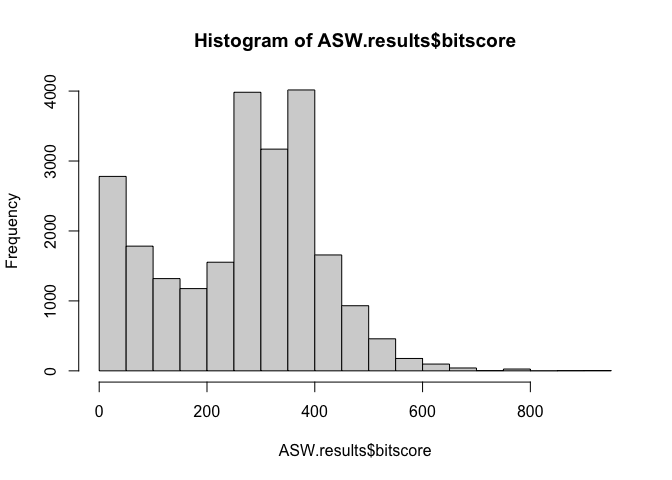
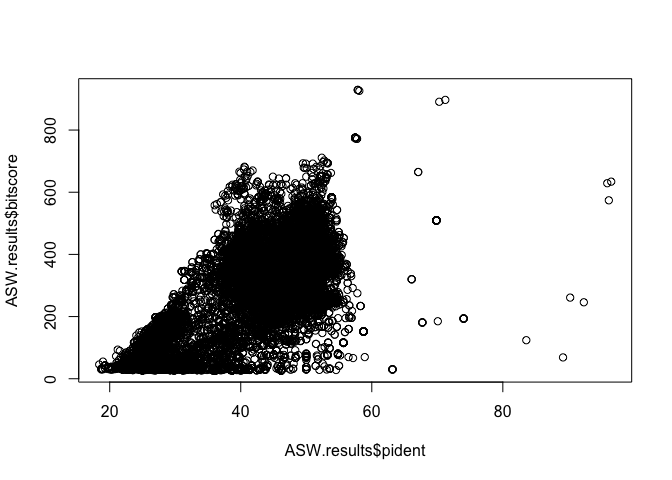
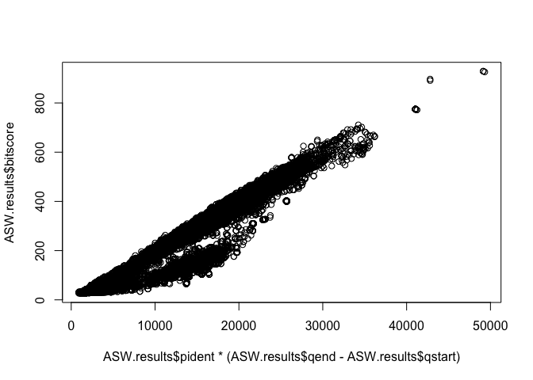
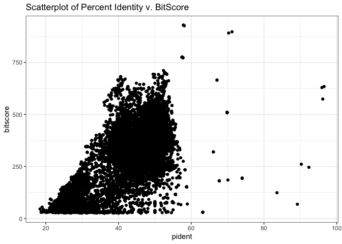
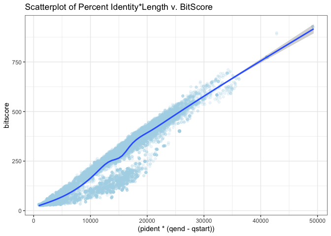

# class16_Homework_R_ggplot
Gabriella Tanoto (A18024184)

- [Loading Packages & Transfer File to
  R](#loading-packages--transfer-file-to-r)
- [Making Histogram of BitScore](#making-histogram-of-bitscore)
- [Answering Questions](#answering-questions)

# Loading Packages & Transfer File to R

Load up ggplot2 for graphing.

``` r
library(ggplot2)
```

Read my .tsv file, and change its column names.

``` r
ASW.results <- read.csv("results_AWSclass16.tsv", sep = "\t")
colnames(ASW.results) <-c("qseqid", "sseqid", "pident", "length", "mismatch", "gapopen", "qstart", "qend", "sstart", "send", "evalue", "bitscore")
```

# Making Histogram of BitScore

You may want to set the optional breaks to be a larger number
(e.g. breaks=30).

``` r
hist(ASW.results$bitscore, breaks = 30)
```



> What do you notice here? Note that larger bitscores are better.

From the histogram, we can see that the bitscore is sort of normally
distributed, but there are also many that is on the lower side. Only a
few alignment results have higher bitscore than 500.

> Is there a straightforward relationship between percent identity
> ($pident) and bitscore ($bitscore) for the alignments we generated?

``` r
plot(ASW.results$pident, ASW.results$bitscore)
```



From the scatterplot above, we can see that it’s somehow related, but
not much.

However, if we take into consideration the length of the sequence
(`$qend-$qstart`), we get a much nicer relationship:

``` r
plot(ASW.results$pident  * (ASW.results$qend - ASW.results$qstart), ASW.results$bitscore)
```



This graph suggests that we will get a higher bitscore as we have a
longer match and a better percent identity.

These graphs can also be made in ggplot as follows:

``` r
ggplot(ASW.results) + 
  aes (x = pident, y = bitscore) +
  geom_point() +
  ggtitle("Scatterplot of Percent Identity v. BitScore") +
  theme_bw()
```



Then, when we include also the length of the sequence that matches:

``` r
ggplot(ASW.results) +
  aes(x = (pident * (qend - qstart)),
      y = bitscore) +
  geom_point(alpha = 0.2, color = "lightblue") +
  geom_smooth()+
  ggtitle("Scatterplot of Percent Identity*Length v. BitScore") +
  theme_bw()
```

    `geom_smooth()` using method = 'gam' and formula = 'y ~ s(x, bs = "cs")'



# Answering Questions

If we were doing this graphing in the supercomputer AWS server, we woudl
have to transfer it to our local laptop using the codes below (into our
laptop’s terminal):

`scp -i ~/Downloads/barry_bioinf.pem -r ubuntu@YOUR_IP_ADDRESS:~/work/* .`

> Q. Note the addition of the -r option here: What is it’s purpose? Also
> what about the \*, what is it’s purpose here?

The -r addition stands for recursively copying the directory (/work/),
so we can make sure everything within that directory is copied into our
personal computers. The `*` will copy ALL of the things we have in that
directory, both the subdirectories and files. It basically copies
everything that has the indicated absolute path (i.e., `~/work/`).
