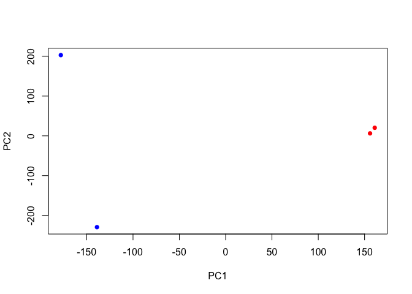
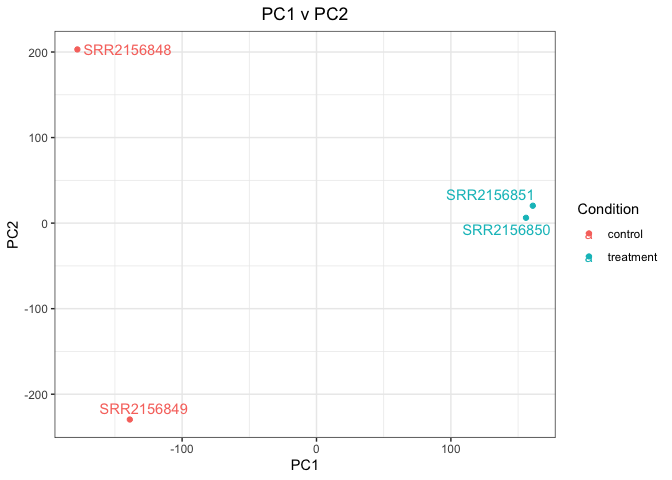
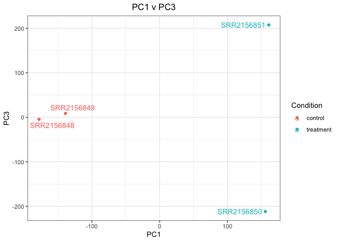
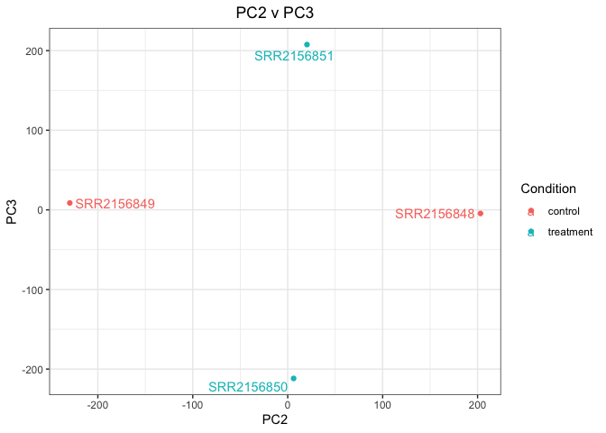

# Class17
Gabriella Tanoto (A18024184)

# Done in Class

The command that worked to log into the AWS server today:
`ssh -i ~/Downloads/BIMM143_GTan.pem ubuntu@ec2-54-214-189-205.us-west-2.compute.amazonaws.com`

To get it, we need to install the software to get the SRA.

### Download

`curl -O https://ftp-trace.ncbi.nlm.nih.gov/sra/sdk/current/sratoolkit.current-ubuntu64.tar.gz`

### Unzip and Untar

`gunzip sratoolkit.current-ubuntu64.tar.gz`
`tar -xvf sratoolkit.current-ubuntu64.tar` ^ `tar` = tape archive

### Typing the full path is annoying and it will make u type something wrong.

So, let’s make it easier.

- echo: will print out things `echo $PATH` \>
  /usr/local/sbin:/usr/local/bin:/usr/sbin:/usr/bin:/sbin:/bin:/usr/games:/usr/local/games:/snap/bin

### this shows every commands we have in unix.

Now we want to make SRAtoolkit as one of our commands, so it makes it
easier for us to go back here.

`export PATH=$PATH:/home/ubuntu/class17/sratoolkit.3.2.1-ubuntu64/bin`

To get a dataset from a study in NCBI, we need the Accession number. \>
`prefetch SRR600956`  
\> `fastq-dump SRR600956/` \#will download the fastq files!  
\> `fastq-dump --split-3 SRR2156848` \#will download the files into
separate files.

For the fastq file, we use: \> `grep -c "@SRR" [SRR600956.fastq]`  
\# we want to add the @SRR because @ is also a QC character.  
\# Import data to R

## Kallisto

Then, we download Kallisto program to read the fastq files and see how
much of each annotated genes are expressed in our sample – kind of like
Galaxy, but faster.

### Build an index using a reference genome (have to download file first)

kallisto index -i hg19.ensembl Homo_sapiens.GRCh37.67.cdna.all.fa

### Getting a quantification of expression of each genes:

kallisto quant -i hg19.ensembl -o SRR2156848_quant SRR2156848_1.fastq
SRR2156848_2.fastq

### Making this prev. command simultaneously by using a nano file (\[FILENAME\].sh) !

Write down the three commands for each files. Then, we can put in `&` if
we want it to run in the background, all three simultaneously.

> chmod +x \[FILENAME\].sh \# to tell UNIX that this file is a run-able
> program. ./\[FILENAME\].sh \#run!!!

### Downloading the file into our local computer

Once we get all the quant data back, we can send it to our **local
computaH**!!! We type in this command in our LOCAL terminal:

> `scp -r -i /Users/abel/Downloads/BIMM143_GTan.pem ubuntu@ec2-54-214-189-205.us-west-2.compute.amazonaws.com:/home/ubuntu/class17/*_quant .`

^ the `.` is to make it download to the directory we are at

# HOMEWORK:

## Importing downloaded files to R

Importing the files we obtained from cloud supercomputer
data-processing:

``` r
library(tximport)

# setup the folder and filenames to read
folders <- dir(pattern="SRR21568*")
samples <- sub("_quant", "", folders)
files <- file.path( folders, "abundance.h5" )
names(files) <- samples

txi.kallisto <- tximport(files, type = "kallisto", txOut = TRUE)
```

    1 2 3 4 

Taking a peek into our imported kallisto files:

``` r
head(txi.kallisto$counts)
```

                    SRR2156848 SRR2156849 SRR2156850 SRR2156851
    ENST00000539570          0          0    0.00000          0
    ENST00000576455          0          0    2.62037          0
    ENST00000510508          0          0    0.00000          0
    ENST00000474471          0          1    1.00000          0
    ENST00000381700          0          0    0.00000          0
    ENST00000445946          0          0    0.00000          0

Total of gene expressions on each columns:

``` r
colSums(txi.kallisto$counts)
```

    SRR2156848 SRR2156849 SRR2156850 SRR2156851 
       2563611    2600800    2372309    2111474 

There are about 94,561 genes that are expressed in at least one of the
samples.

``` r
sum(rowSums(txi.kallisto$counts)>0)
```

    [1] 94561

## Cleaning out the data

Filtering out transcripts with no reads:

``` r
to.keep <- rowSums(txi.kallisto$counts) > 0
kset.nonzero <- txi.kallisto$counts[to.keep,]
```

And filter out the ones without the changes over the samples:

``` r
keep2 <- apply(kset.nonzero,1,sd)>0
x <- kset.nonzero[keep2,]
```

## Plotting the PCA

Making the PCA from the filtered dataset:

``` r
pca <- prcomp(t(x), scale=TRUE)
summary(pca)
```

    Importance of components:
                                PC1      PC2      PC3   PC4
    Standard deviation     183.6379 177.3605 171.3020 1e+00
    Proportion of Variance   0.3568   0.3328   0.3104 1e-05
    Cumulative Proportion    0.3568   0.6895   1.0000 1e+00

Plotting the PCA, with `x = PC1` and `y = PC2`.

``` r
plot(pca$x[,1], pca$x[,2],
     col=c("blue","blue","red","red"),
     xlab="PC1", ylab="PC2", pch=16)
```



> Q. Use ggplot to make a similar figure of PC1 vs PC2 and a seperate
> figure PC1 vs PC3 and PC2 vs PC3.

``` r
library(ggplot2)
library(ggrepel)

attributes(pca)
```

    $names
    [1] "sdev"     "rotation" "center"   "scale"    "x"       

    $class
    [1] "prcomp"

``` r
# Make metadata object for the samples
colData <- data.frame(condition = factor(rep(c("control", "treatment"), each = 2)))
rownames(colData) <- colnames(txi.kallisto$counts)

# Make the data.frame for ggplot 
y <- as.data.frame(pca$x)
y$Condition <- as.factor(colData$condition)

ggplot(y) +
  aes(PC1, PC2, col=Condition) +
  geom_point() +
  geom_text_repel(label=rownames(y)) +
  ggtitle("PC1 v PC2") + theme_bw() +
  ggeasy::easy_center_title()
```



``` r
ggplot(y) +
  aes(PC1, PC3, col=Condition) +
  geom_point() +
  geom_text_repel(label=rownames(y)) +
  ggtitle("PC1 v PC3") + theme_bw() +
  ggeasy::easy_center_title()
```



``` r
ggplot(y) +
  aes(PC2, PC3, col=Condition) +
  geom_point() +
  geom_text_repel(label=rownames(y)) +
  ggtitle("PC2 v PC3") + theme_bw() +
  ggeasy::easy_center_title()
```


